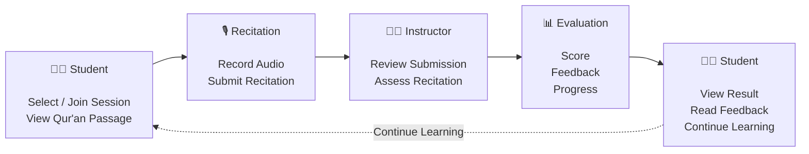

# 🕌 e-Tasmi AI Learning Loop

  
  
  
  
  

  

  <strong>From AI-Assisted Recitation Analysis to Instructor-Verified Learning</strong>

  Turning verified findings into the learner's next practice step.

  <a href="https://e-tasmi.com">Live Website</a>
  •
  <a href="#-the-learning-loop">Learning Loop</a>
  •
  <a href="#-ai--trust">AI & Trust</a>
  •
  <a href="#-technology-stack">Technology</a>
  •
  <a href="#-project-status">Project Status</a>

---

## 🌐 Live Product

### Experience e-Tasmi

  

**Live:** https://e-tasmi.com

e-Tasmi is a web-based Qur'an recitation learning platform designed to connect learners and instructors through structured recitation sessions, assessment, feedback, and progress tracking.

> **The existing e-Tasmi platform is the foundation.  
> The AI Learning Loop is the challenge contribution built on top of it.**

---

# 🕌 What is e-Tasmi?

**e-Tasmi** is a web-based Qur'an recitation learning and assessment platform designed to support structured interaction between learners and instructors.

The system provides a digital environment where students can participate in recitation activities, submit their recitations, receive instructor evaluations, review feedback, and continue their learning journey.

The platform is organized around three primary roles:

| Role | Main Responsibility |
|---|---|
| 👨‍🎓 Student | Participate in recitation sessions, submit recitations, view results and feedback |
| 👨‍🏫 Instructor | Manage recitation activities, review submissions, evaluate students and provide feedback |
| 👨‍💼 Administrator | Manage the platform, users, instructors and administrative operations |

---

## 🔄 e-Tasmi Learning Workflow

