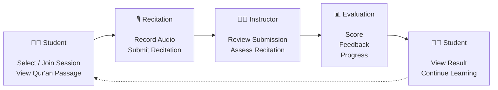
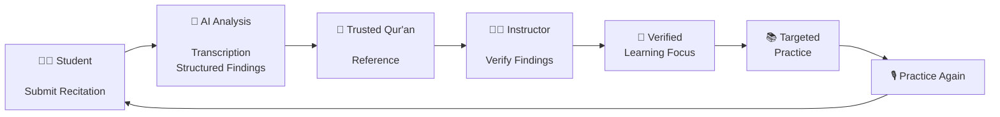
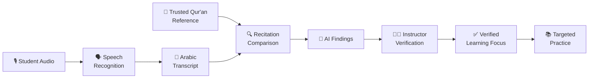

# 🕌 e-Tasmi AI Learning Loop

  

  
  

<h2 align="center">
  From AI-Assisted Recitation Analysis 
  to Instructor-Verified Learning
</h2>

  <em>Turning verified findings into the learner's next practice step.</em>

  

  
  
  
  

  <a href="#-what-is-e-tasmi">What is e-Tasmi</a>
  •
  <a href="#-the-learning-loop">Learning Loop</a>
  •
  <a href="#-ai--trust">AI & Trust</a>
  •
  <a href="#-technology-stack">Technology</a>
  •
  <a href="#-project-status">Status</a>

---

## 🏆 AI Challenge in Service of Islamic Content 2026

### Track 03 — Interactive Experiences & Learning Journeys for Islam

**e-Tasmi AI Learning Loop** is an e-Tasmi project developed for the **AI Challenge in Service of Islamic Content 2026**.

The project focuses on transforming AI-assisted Qur'an recitation analysis into an **instructor-verified learning experience**.

> **AI analyzes. Instructors verify. Learners improve.**

---

## 🌐 Live Product

  <strong>https://e-tasmi.com</strong>

---

## 🕌 What is e-Tasmi?

**e-Tasmi** is a web-based Qur'an recitation learning and assessment platform designed to support structured interaction between learners and instructors.

Students can participate in recitation activities, submit their recitations, receive instructor evaluations, review feedback, and continue their learning journey.

### 👥 Platform Roles

| Role | Responsibility |
|:---:|---|
| 👨‍🎓 **Student** | Participate in recitation sessions, submit recitations, and view results and feedback |
| 👨‍🏫 **Instructor** | Manage recitation activities, review submissions, evaluate students, and provide feedback |
| 👨‍💼 **Administrator** | Manage users, instructors, and platform administration |

---

## 🔄 The Learning Loop

The existing e-Tasmi workflow provides the foundation:

### 🚀 Challenge Learning Loop

The Challenge extends this workflow with an AI-assisted verification and targeted-practice cycle:

  <strong>AI analyzes → Instructor verifies → Learner practices → Recitation improves</strong>

---

## 🧠 AI & Trust

The system is designed around a simple principle:

> **AI assists the instructor. It does not replace the instructor.**

The Qur'an reference is obtained from a trusted source, while AI-generated findings remain subject to instructor verification before becoming part of the learner's guided practice.

---

## ⚡ Core Principle

<table>
<tr>
<td align="center" width="25%">

### 🎙️
**RECITE**

Student submits a Qur'an recitation.

</td>

<td align="center" width="25%">

### 🤖
**ANALYZE**

AI identifies potential findings.

</td>

<td align="center" width="25%">

### 👨‍🏫
**VERIFY**

Instructor accepts, edits, or rejects findings.

</td>

<td align="center" width="25%">

### 🎯
**IMPROVE**

Verified findings guide the next practice.

</td>
</tr>
</table>

---

## 📖 Why This Matters

The goal is not simply to generate an AI score.

The goal is to create a continuous learning cycle:

**Recitation → Analysis → Verification → Learning Focus → Practice → Recitation**

---

## ✨ Project Identity

**e-Tasmi AI Learning Loop**

 

<em>AI Challenge in Service of Islamic Content 2026</em>

 

Track 03 — Interactive Experiences & Learning Journeys for Islam

