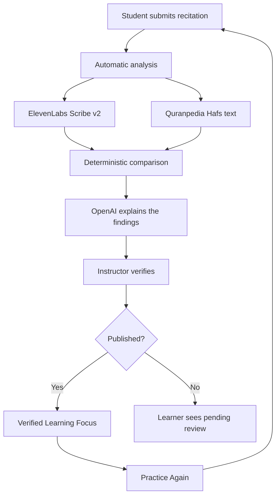
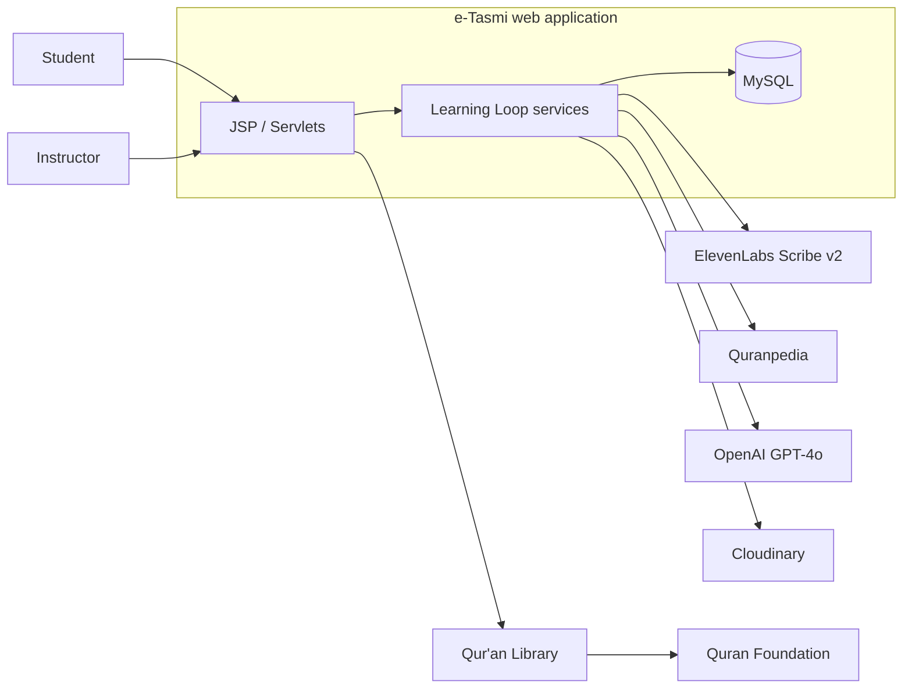

# e-Tasmi AI Learning Loop

> Turning verified findings into the learner's next practice step.

AI-assisted Qur'an recitation learning for **AI Challenge in Service of Islamic Content 2026**, Track 03 — Interactive Experiences & Learning Journeys for Islam.

**AI analyzes. Instructors verify. Learners improve.**

<p align="center">
  
  
  
  
  
  
</p>

---

## The idea

e-Tasmi already let a student submit a recitation and an instructor assign a score.

The challenge contribution is the **learning loop after that score**:

1. AI transcribes the recitation and compares it with a trusted Qur'an passage.
2. The instructor accepts, edits, rejects, or adds each finding.
3. Only verified findings become the learner's next practice step.
4. The learner practises the same passage again.

AI never publishes to the learner. The instructor does.

---

## The learning loop



---

## Why this matters

A score alone does not tell the learner what to practise next.

Without a trusted reference, an AI system can invent Qur'an text.  
Without instructor verification, an unverified finding can reach the learner.  
Without Practice Again, the review ends at a mark.

This project closes that gap.

---

## What was added for the challenge

| Capability | What it does |
|---|---|
| Structured passage | The session stores a surah and ayah range |
| Automatic analysis | A new attempt is analysed without a manual click |
| Trusted Qur'an reference | Comparison text comes from Quranpedia Hafs (`GET /mushafs/1/{surah}`) |
| Deterministic comparison | Word differences are computed in Java, not invented by a model |
| AI explanation | OpenAI GPT-4o explains stored findings. It does not supply the mushaf text |
| Instructor verification | Accept, edit, reject, or add each finding |
| Publication boundary | Pending findings cannot be published |
| Verified Learning Focus | The learner sees only accepted, edited, or instructor-added findings |
| Practice Again | A linked attempt on the same enrolment and passage |
| Safe failure | Silence, non-Qur'an audio, and a missing reference do not invent feedback |

The existing platform remains the foundation: accounts, sessions, enrolment, recitation upload, instructor evaluation, and the Qur'an Library.

---

## How it works

```text
Student records
      │
      ▼
Audio stored  ──►  Speech-to-text (ElevenLabs Scribe v2, Arabic)
      │
      ▼
Trusted passage retrieved from Quranpedia
      │
      ▼
Arabic normalization + word-by-word comparison
      │
      ▼
Structured findings + optional GPT-4o explanation
      │
      ▼
Instructor reviews  →  publishes
      │
      ▼
Learner sees verified focus  →  Practice Again
```

---

## AI and trust boundaries

- **AI analyzes.** Transcription and explanation are advisory.
- **Instructors verify.** Every finding is reviewed before publication.
- **Learners improve.** The next attempt starts from verified guidance.

If the trusted reference cannot be loaded, the comparison is withheld. No AI-generated Qur'an text is stored.  
If no speech is detected, the analysis is `CANNOT_EVALUATE` and cannot be published until it succeeds.  
If the audio is not a Qur'an recitation, the analysis is `REJECTED`. The instructor may publish a manual score; the AI analysis is not retried.

---

## Architecture



| Layer | Implementation |
|---|---|
| Application | Java 17, Servlet/JSP, Tomcat 9 |
| Database | MySQL 8.4 |
| Speech-to-text | ElevenLabs Scribe v2 (`STT_PROVIDER=elevenlabs`) |
| Trusted reference | Quranpedia Hafs mushaf id 1 — no API key |
| Explanation | OpenAI GPT-4o |
| Library content | Quran Foundation Content API |
| Media | Cloudinary, or local disk when Cloudinary is unset |
| Packaging | Docker Compose |

Details: [docs/architecture/learning-loop.md](docs/architecture/learning-loop.md)

---

## Setup

The challenge copy is isolated. It does not share containers or volumes with a production e-Tasmi installation.

```powershell
cd e-Tasmi
copy .env.example .env
docker compose up -d --build
```

| Service | Local URL |
|---|---|
| Application | http://localhost:8084 |
| phpMyAdmin | http://localhost:8083 |
| MySQL (host) | localhost:3317 |

First startup creates the schema and a bootstrap admin at `admin@etasmi.com`. The password is generated by `DBSeeder` and is not printed in this README. To choose the local password yourself, set `ETASMI_BOOTSTRAP_ADMIN_PASSWORD` in the ignored `.env` file before startup.

Optional synthetic demo users are in `e-Tasmi/e-Tasmi/setup/sample_data.sql`. They reuse the bootstrap admin password hash. Their emails are `student.demo@etasmi.local` and `instructor.demo@etasmi.local`.

Full steps: [docs/development/installation.md](docs/development/installation.md)

---

## Configuration

Copy `e-Tasmi/.env.example` to `e-Tasmi/.env`. Never commit `.env`.

Required for the learning-loop demo:

| Variable | Purpose |
|---|---|
| `OPENAI_API_KEY` | Finding explanation |
| `STT_PROVIDER` | Set `elevenlabs` for Scribe v2 |
| `ELEVENLABS_API_KEY` | Speech-to-text |
| `ELEVENLABS_STT_MODEL` | `scribe_v2` (default) |
| `QURANPEDIA_API_ENDPOINT` | Leave unset, or `https://api.quranpedia.net/v1`. Do not set it empty |
| `CLOUDINARY_*` | Durable recitation storage on cloud hosts |

Local Docker Compose supplies MySQL. On Railway, use `MYSQLHOST`, `MYSQLPORT`, `MYSQLDATABASE`, `MYSQLUSER`, and `MYSQLPASSWORD`.

Email verification is off by default (`EMAIL_VERIFICATION_ENABLED=false`). Zoom and SMTP are optional and are not required for the learning loop.

---

## Validation

Functional validation of the challenge workflow:

- 31 / 31 recorded validation cases passed
- 32 / 32 comparison self-checks passed

Covered behaviour includes automatic analysis, Quranpedia comparison, instructor verification, publication, Verified Learning Focus, Practice Again, ownership checks, and safe failure.

These are functional results. They are not recognition-accuracy or learning-gain claims.

Record: [docs/challenge/validation.md](docs/challenge/validation.md)

---

## Project structure

```text
.
├── README.md
├── .gitignore
├── docs/                      Public documentation
│   ├── architecture/
│   ├── baseline/
│   ├── challenge/
│   ├── development/
│   └── testing/
└── e-Tasmi/                   Isolated challenge application
    ├── docker-compose.yml
    ├── Dockerfile
    ├── .env.example
    └── e-Tasmi/               Java / JSP source
```

---

## Challenge scope

**Baseline** (tag `baseline-pre-ai-challenge-2026`): existing e-Tasmi accounts, sessions, recitation upload, instructor scoring, Qur'an Library, and instructor-triggered AI analysis.

**Challenge contribution:** the verified learning loop described above.

Pre-challenge work is not claimed as challenge work. See [docs/baseline/](docs/baseline/README.md).

---

## Limitations

- Email verification is disabled in this challenge copy so local registration does not depend on SMTP.
- Payment is a manual QR and receipt flow. There is no ToyyibPay integration.
- Zoom live sessions are optional and are not required to demonstrate the learning loop.
- The Qur'an Library still uses Quran Foundation. The Learning Loop comparison source is Quranpedia.
- No recognition-accuracy or learning-improvement statistic is claimed.

---

## Documentation

| Start here | Document |
|---|---|
| This README | Product overview |
| [docs/README.md](docs/README.md) | Documentation index |
| [docs/architecture/learning-loop.md](docs/architecture/learning-loop.md) | Current architecture |
| [docs/challenge/contribution-log.md](docs/challenge/contribution-log.md) | What was implemented |
| [docs/development/installation.md](docs/development/installation.md) | How to run it |
| [docs/challenge/history/](docs/challenge/history/README.md) | Earlier audits. Not current implementation |

---

## Participant

**Elhessan Abdelrahman Adam** — Individual entry, Track 03.
