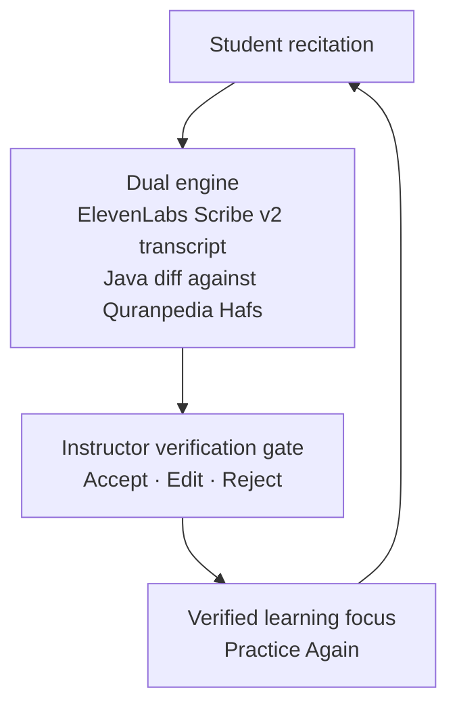

  

<h1 align="center">e-Tasmi</h1>

  <strong>Turning instructor-verified findings into the learner’s next practice step.</strong> 
  Track 03 — Interactive Experiences &amp; Learning Journeys for Islam 
  AI Challenge in Service of Islamic Content 2026

  

  
  
  
  
  
  
  

---

## 1. What is e-Tasmi?

e-Tasmi closes the gap between a recitation score and the learner’s next practice step. After a student submits audio, the system transcribes it, compares it with a trusted Qur’an passage, and holds every finding until an instructor verifies it. Only published, instructor-verified findings become the learner’s next assignment.

| Deterministic orthography | Advisory AI | Human authority |
|---|---|---|
| Word differences are a Java alignment against Quranpedia Hafs text. The same transcript always yields the same findings. | ElevenLabs Scribe v2 transcribes. GPT-6.1 Sol explains stored findings. The model does not write the mushaf text. | Findings stay `PENDING` until the instructor accepts, edits, or rejects them. Pending work cannot be published. |

> [!IMPORTANT]
> The learner never sees an unverified finding. Publication is a server-side gate, not a hidden button.

## 2. End-to-end workflow

1. **Student recitation.** Audio is stored for a session that already names the surah and ayah range.
2. **Dual engine.** Scribe v2 produces the Arabic transcript. Quranpedia supplies Hafs mushaf text (`GET /mushafs/1/{surah}`). A deterministic orthographic alignment computes the findings. GPT-6.1 Sol then explains those findings.
3. **Instructor verification.** Each finding is accepted, edited, rejected, or added by the instructor who owns the session.
4. **Verified learning focus.** After publication, the learner sees the score, the instructor’s words, and the practice list, then starts a linked Practice Again attempt.

> [!NOTE]
> If Quranpedia cannot be reached, the comparison is withheld and no Qur’an text is generated. Silence stays `CANNOT_EVALUATE`. Non-Qur’an audio is `REJECTED` and is not retried.

## 3. Verification gate

| Instructor action | Stored state | Shown to the learner after publication |
|---|---|---|
| Accept | `ACCEPTED` | Yes |
| Edit | `EDITED` | Yes |
| Add | `INSTRUCTOR_ADDED` | Yes |
| Reject | `REJECTED` | No |
| Not yet reviewed | `PENDING` | No. Publication is refused. |

An ordinary published review must carry a Quranpedia reference. Student Progress then shows that published history and compares the latest attempt with the one it was practised from.

## 4. Stack at a glance

| Layer | What runs there |
|---|---|
| Presentation | JSP and project CSS on Tomcat 9 |
| Orchestration | Java 17 servlets. Servlet API 4.0 |
| Speech and explanation | ElevenLabs Scribe v2 · OpenAI GPT-6.1 Sol |
| Trusted text | Quranpedia Hafs API |
| Library | Quran Foundation Content API |
| Persistence | MySQL 8.4 |
| Delivery | Docker Compose · Cloudinary for audio when configured |

Architecture detail: [docs/architecture/learning-loop.md](docs/architecture/learning-loop.md)

## 5. Evidence and where to go next

Functional validation recorded **31 / 31** workflow cases and **32 / 32** deterministic alignment checks. These results describe the learning loop. They are not a claim about recognition accuracy or learning gain.

| | |
|---|---|
| Live system | [https://e-tasmi.com](https://e-tasmi.com) |
| Install locally | [docs/development/installation.md](docs/development/installation.md) |
| Validation record | [docs/challenge/validation.md](docs/challenge/validation.md) |
| What was built | [docs/challenge/contribution-log.md](docs/challenge/contribution-log.md) |
| Tools and licences | [docs/evidence/README.md](docs/evidence/README.md) |
| Documentation index | [docs/README.md](docs/README.md) |

  <strong>Elhessan Abdelrahman Adam</strong> 
  Individual entry · Track 03 
  AI Challenge in Service of Islamic Content 2026

