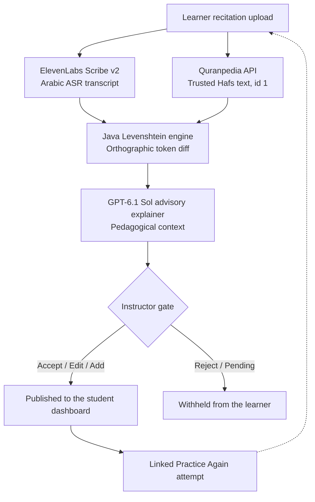

  
  
  
  

<h1 align="center">🕌 e-Tasmi — AI-Assisted Qur'an Learning Loop</h1>

  <strong>Turning instructor-verified findings into the learner’s next practice step.</strong> 
  Track 03 — Interactive Experiences &amp; Learning Journeys for Islam | AI Challenge in Service of Islamic Content 2026

  

  <a href="https://e-tasmi.com"><strong>🔗 Launch Live Demonstration: e-tasmi.com</strong></a>

---

## 📌 System Overview

---

A score alone does not tell a learner what to practise next. e-Tasmi bridges that gap: a deterministic comparison against trusted Hafs text, an advisory explanation of those findings, and an instructor gate before anything is published.

| 📐 Deterministic diff | 🤖 Advisory AI | 🛂 Strict gatekeeper |
|---|---|---|
| Mushaf text is never generated by the model. Word differences are matched in Java against Hafs text from Quranpedia. | GPT-6.1 Sol explains findings that already exist. It does not invent verses. | Findings stay `PENDING` until an instructor explicitly verifies them. |

> [!IMPORTANT]
> Publication is a server-side barrier. A `PENDING` finding cannot reach the learner, and an unverified analysis cannot be published.

> [!NOTE]
> If the trusted passage cannot be loaded, the comparison is withheld and no Qur'an text is stored.

## 🛠️ Technical Stack & Tools

---

**Backend & server**

**Database & media**

**AI & speech engines**

**Trusted references & integrations**

**Infrastructure & containerization**

## 🔄 End-to-End Workflow

---

> [!NOTE]
> Accept, edit, and instructor-added findings are the only items in the verified learning focus. Rejected and pending findings stay off the student screen.

  <a href="docs/architecture/learning-loop.md">Architecture</a>
  ·
  <a href="docs/development/installation.md">Local setup</a>
  ·
  <a href="docs/challenge/validation.md">Validation · 31/31 and 32/32</a>
  ·
  <a href="docs/evidence/README.md">Tools &amp; evidence</a>
  ·
  <a href="docs/README.md">Docs index</a>

  <strong>Elhessan Abdelrahman Adam</strong> 
  Individual entry · Track 03 · AI Challenge in Service of Islamic Content 2026

