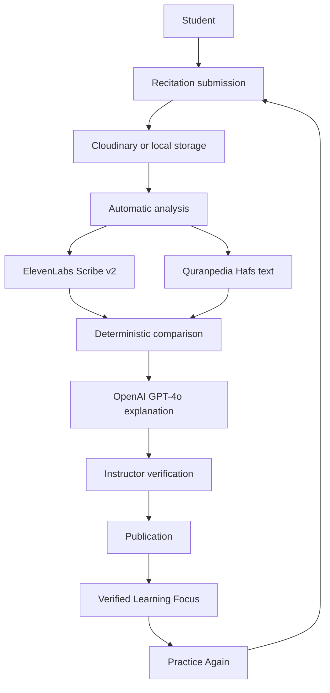

# Learning Loop architecture

This is the current challenge architecture. The pre-challenge system is documented in [../baseline/architecture/README.md](../baseline/architecture/README.md).

## Product flow



## Trust boundary

```text
AI findings          Instructor decision         Learner
─────────────        ───────────────────         ───────
PENDING       ──►    Accept / Edit / Reject
                     or add a finding      ──►   published result only
```

There is no path from an unverified finding to the learner.

## External services

| Service | Role in the Learning Loop | Credential |
|---|---|---|
| ElevenLabs | Speech-to-text (`scribe_v2`, `language_code=ar`) | `ELEVENLABS_API_KEY` |
| Quranpedia | Trusted comparison text, mushaf 1 (Hafs) | None. Public HTTPS API |
| OpenAI | Explains stored findings | `OPENAI_API_KEY` |
| Cloudinary | Recitation media | `CLOUDINARY_CLOUD_NAME`, `CLOUDINARY_API_KEY`, `CLOUDINARY_API_SECRET` |
| Quran Foundation | Qur'an Library only | `QF_CLIENT_ID`, `QF_CLIENT_SECRET` |
| Zoom | Optional live sessions | Optional |
| Email | Optional password reset | Optional |

## Safe failure

| Condition | Stored status | Publication |
|---|---|---|
| No speech | `CANNOT_EVALUATE` | Blocked until analysis succeeds |
| Non-Qur'an audio | `REJECTED` | Instructor may publish a manual score. AI is not retried |
| Quranpedia unreachable | `REFERENCE_UNAVAILABLE` | No findings. No generated Qur'an text |

## Application stack

Java 17 servlets and JSP on Tomcat 9, MySQL 8.4, packaged with Docker. API keys are read from environment variables and are never sent to the browser.
