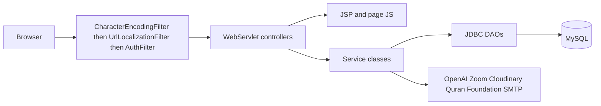
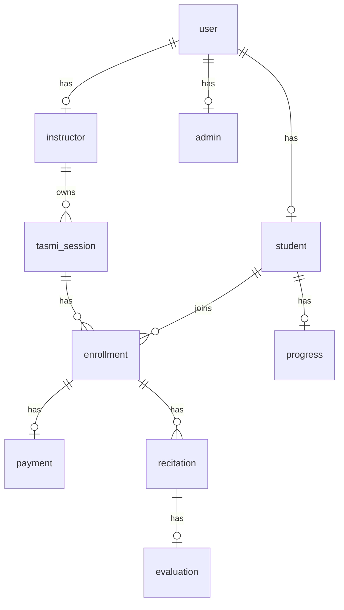
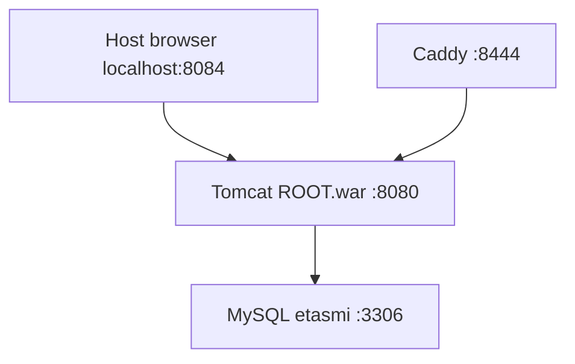
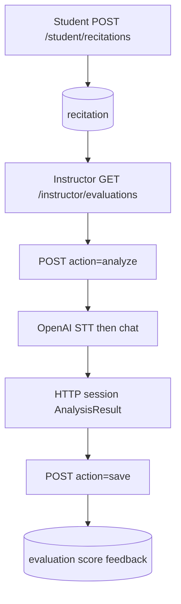
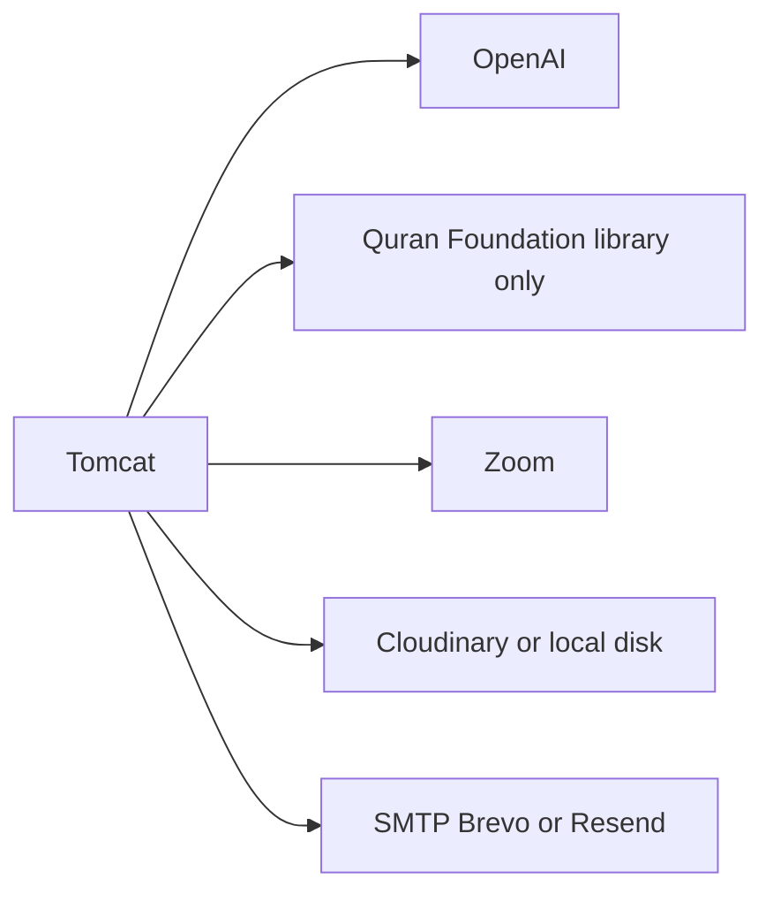
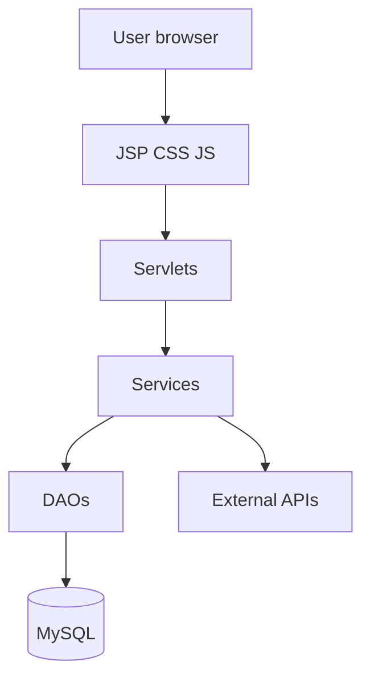

> **Historical document.** This audit was written on 2 October 2026, before the Learning Loop, Quranpedia comparison, and ElevenLabs speech-to-text were in place. It is not current implementation documentation. For the current system, use the root README, [../README.md](../README.md), [../../architecture/learning-loop.md](../../architecture/learning-loop.md), and [../validation.md](../validation.md).

# MASTER SYSTEM AUDIT — e-Tasmi AI Learning Loop

Inspection date: 2026-10-02. Source of truth: repository code, SQL, Docker, and documentation on branch `master` at commit `26043b1`. No application code was changed for this audit.

Labels used throughout:

- **A. IMPLEMENTED** — present in running code paths
- **B. PARTIAL** — code exists but incomplete, unused, or not the live path
- **C. CONFIGURED, NOT VERIFIED** — env/docs exist; this audit did not call the live service
- **D. DOCUMENTED, NOT IMPLEMENTED**
- **E. PLANNED CHALLENGE** — future work, not built
- **F. UNKNOWN — NOT VERIFIED**

Secret values are never shown. Names only: `[SECRET — VALUE NOT SHOWN]`.

---

## Executive summary

e-Tasmi is a Java Servlet/JSP Tasmi (Qur’an recitation) platform: students enroll in instructor sessions, upload or record recitation audio, and instructors score that audio with optional OpenAI-assisted analysis. Admins approve instructors and manage users, payments, and reports.

**Architecture (A):** Browser → JSP + page JS → `@WebServlet` controllers → service classes → JDBC DAOs (`PreparedStatement`) → MySQL 8.4. Session auth via `JSESSIONID`. `AuthFilter` enforces role and instructor approval. WAR is built inside Docker (JDK 17, Tomcat 9) and deployed as `ROOT.war`.

**Roles (A):** `STUDENT`, `INSTRUCTOR`, `ADMIN` on `user.role`. Instructors also have `instructor.verification_status` (`PENDING` / `APPROVED` / `REJECTED`).

**Main workflows (A):** registration and login; instructor session creation (Zoom if configured); student enrollment and QR/manual payment; recitation submit into `recitation`; instructor evaluation into `evaluation` (score + feedback); student sees that score/feedback. Progress is the average of those scores.

**Current AI (A, instructor-triggered only):** `RecitationAiAnalysisService` calls OpenAI transcription then a JSON chat evaluation. Expected text is free-text `tasmi_session.quran_portion`, not Quran Foundation. Structured word lists exist only in memory (`AnalysisResult` + HTTP session). They are not stored in MySQL. Saving an evaluation deletes the session copy. Students do not receive those findings.

**Quran Foundation (A, separate product surface):** student Qur’an library (chapters, verses by chapter and by key, search, tafsir/translation resources, chapter audio). Live Content API verification on 2026-09-28 returned verse `2:1` and chapter-2 page 1 (`2:1`–`2:5`) with Arabic in `text_uthmani`. That library is **not** wired into recitation analysis.

**Database (A):** 20 tables in `e-Tasmi/e-Tasmi/setup/railway_schema.sql`. No AI-finding, verse-key, learning-focus, or attempt-parent tables.

**Deployment:** Challenge copy uses Compose project `etasmi-ai-challenge` (app host `8084`, MySQL `3317`, phpMyAdmin `8083`, Caddy `8444`). Railway is supported by `MYSQL*` env and `SchemaBootstrap`, not by a `railway.toml` in this repo. Original production e-Tasmi on the same machine is a different Compose project; this audit did not inspect that installation.

**What does not exist (E):** trusted verse-keyed reference inside AI compare; persisted structured findings; per-finding Accept/Edit/Reject; Verified Learning Focus; Practice Again linked attempts; ElevenLabs; Quranpedia.

**Challenge-copy change already on master (A, not baseline):** `EMAIL_VERIFICATION_ENABLED` defaults to false so registration does not require email. Commit `31f2fd9`. Baseline tag `baseline-pre-ai-challenge-2026` still points at `a358719`.

---

## 1. Repository structure

```
e-Tasmi-AI-Challenge/
├── README.md                          # repo overview (GitHub landing)
├── documentation/
│   ├── baseline/                      # pre-challenge baseline docs and screenshots
│   ├── challenge/                     # planned challenge docs + this audit
│   ├── setup/                         # local install notes
│   └── final/                         # submission placeholders
└── e-Tasmi/                           # application root (Compose context)
    ├── Dockerfile
    ├── docker-compose.yml
    ├── Caddyfile
    ├── .env.example                   # placeholders only
    ├── README.md
    └── e-Tasmi/                       # NetBeans-style web module
        ├── src/java/controller/       # servlets + filters
        ├── src/java/model/entity/
        ├── src/java/model/dao/ + impl/
        ├── src/java/model/service/    # including quran/
        ├── src/java/util/
        ├── src/java/setup/DBSeeder.java
        ├── web/jsp/                   # auth, student, instructor, admin
        ├── web/assets/js/ + css/ + locales/
        ├── web/WEB-INF/web.xml
        ├── web/WEB-INF/db/railway_schema.sql
        ├── web/WEB-INF/lib/           # mysql-connector-j, jbcrypt, mail, pdfbox, jsoup, jstl
        └── setup/*.sql
```

No Maven/Gradle build file. Compile is `javac` inside the Dockerfile. No `src/test` tree. No `railway.toml`.

---

## 2. Technology stack

| Technology | Version evidence | Where | Runtime? |
|---|---|---|---|
| Java | `javac -source 17 -target 17` in Dockerfile; image `eclipse-temurin:17-jdk-jammy` | Dockerfile | Build |
| Servlet | `web-app` 3.1; `servlet-api-4.0.1.jar` on classpath | `web.xml`, `WEB-INF/lib` | Compile; Tomcat provides runtime API |
| JSP | Jasper `JspServlet` in `web.xml` | Tomcat 9 | Yes |
| Tomcat | image `tomcat:9.0-jdk17-temurin` | Dockerfile | Yes |
| MySQL | image `mysql:8.4` | `docker-compose.yml` | Yes (challenge DB) |
| JDBC | `mysql-connector-j-9.0.0.jar`; `util.Db` / `RailwayDataSourceFactory` | `WEB-INF/lib`, `util` | Yes |
| HTML/CSS/JS | JSP + static assets; Tailwind CDN only on instructor evaluations page | `web/` | Yes |
| Bootstrap | **Not found** as a project dependency | — | No |
| Docker Compose | file version unpinned; project name `etasmi-ai-challenge` | `e-Tasmi/docker-compose.yml` | Local |
| Caddy | image `caddy:2-alpine` | compose + `Caddyfile` | Optional local HTTPS |
| phpMyAdmin | image `phpmyadmin:5-apache` | compose | Local admin UI |
| Password hash | jBCrypt jar `jbcrypt-0.4.jar`, cost 12; PBKDF2 fallback | `PasswordUtil` | Yes |
| Git | branch `master`; remote `Elhessan2000/e-tasmi-ai-learning-loop` | git | — |

JSP compiler source/target in `web.xml` is `1.8` while the image compiles application classes as 17. Both are in the repo; runtime effect of the JSP 1.8 setting was **not re-verified** in this audit.

---

## 3. System architecture



Request path:

1. `CharacterEncodingFilter` (`/*`) forces UTF-8.
2. `UrlLocalizationFilter` strips `/en`, `/ar`, `/ms` prefixes (`util.LocaleSupport`).
3. `AuthFilter` on `/student/*`, `/instructor/*`, `/admin/*`, matching JSP paths, `/notifications`, `/live/*`. Public auth and `/home` are outside that filter.
4. Servlet reads session `userId` / `role`, calls a service, forwards a JSP or redirects.
5. `util.Db` connection order: `MYSQLHOST`+`MYSQLDATABASE`+`MYSQLUSER`, else `MYSQL_URL`, else `ETASMI_JDBC_*`, else JNDI `java:comp/env/jdbc/ETasmiDS` (`RailwayDataSourceFactory` in `META-INF/context.xml`).

Error handling is per-servlet: user-facing strings, `LOGGER` at WARNING/SEVERE. There is no global exception mapper.

---

## 4. User roles and permissions

Roles exist only as `user.role` plus instructor `verification_status`. There is no permission table.

| Function | Student | Instructor | Admin |
|---|---|---|---|
| Self-register | Yes (`/auth/register`) | Yes, then PENDING | No (seeded `admin@etasmi.com`) |
| Login | Yes if ACTIVE | Yes even while PENDING | Yes (email gate skipped for ADMIN) |
| Instructor routes | No | Only if session status APPROVED; else `pendingApproval.jsp` | No |
| Create session | No | Yes | No |
| Enroll / pay / submit recitation | Yes | No | No |
| Analyze + score recitation | No | Yes, own sessions | No |
| Approve instructor | No | No | Yes |
| User CRUD, reports, audit log, admin payments | No | No | Yes |

Registration when `EMAIL_VERIFICATION_ENABLED` is false (challenge default): student `user.status=ACTIVE`; instructor `user.status=INACTIVE` and `instructor.verification_status=PENDING`. When the flag is true, both start `INACTIVE` and `email_verified=0` and are sent to `/auth/verify-email`.

---

## 5. Authentication and authorization

| Step | Implementation |
|---|---|
| Register | `RegisterServlet` → `RegistrationService.register` |
| Login | `LoginServlet` → `AuthService.login` → `SessionUtil.createUserSession` (invalidates old session) |
| Logout | `LogoutServlet` `/auth/logout` |
| Hash | `PasswordUtil.hashPassword` BCrypt cost 12 |
| Session keys | `userId`, `role`, `fullName`, `email`, `instructorVerificationStatus` |
| Cookie | `JSESSIONID` HttpOnly (observed on challenge HTTP). `web.xml` has **no** `<session-config>`. Timeout: **UNKNOWN — NOT VERIFIED** (container default, not set here) |
| Route guard | `AuthFilter` |
| Password reset | `ForgotPasswordServlet`, `ResetPasswordServlet`, table `password_reset`, `EmailUtil` |
| Email verification | `EmailVerificationService`, `VerifyEmailServlet`, `ResendVerificationServlet`, `VerifyStatusServlet`. Frozen off when `EMAIL_VERIFICATION_ENABLED` is not `1`/`true`/`yes` (`util.EmailVerificationConfig`) |
| Instructor approval | `InstructorVerificationService` + `InstructorVerificationServlet`. Approval no longer requires `email_verified` when the flag is false |

`ETASMI_ALLOW_LOGIN_WITHOUT_EMAIL_VERIFICATION` is an extra login-only bypass when verification is enabled.

---

## 6. Student flow (implemented)

| Step | Route | Servlet | Service / DAO | Tables |
|---|---|---|---|---|
| Register | POST `/auth/register` | `RegisterServlet` | `RegistrationService` | `user`, `student`, `notifications` |
| Login | POST `/auth/login` | `LoginServlet` | `AuthService` | `user` read |
| Dashboard | GET `/dashboard` → `/student/dashboard` | `DashboardRouterServlet`, `StudentDashboardServlet` | dashboard services | sessions, enrollments, progress |
| Browse / enroll | `/student/sessions`, `/student/enroll-confirm`, `/student/enrollments` | `StudentSessionsServlet`, `StudentEnrollmentsServlet` | enrollment services | `enrollment` |
| Pay | `/student/payments`, `/student/payments/qr`, `/student/payments/submit` | `StudentPaymentsServlet`, `StudentQrPaymentServlet` | payment services | `payment` |
| Recite | GET/POST `/student/recitations` | `StudentRecitationServlet` | `RecitationService.submit` | `recitation` insert |
| Hear own audio | `/student/recitation-audio` | `StudentRecitationAudioServlet` | file/Cloudinary | `recitation.audio_file_path` |
| Result | same recitations page modal | servlet builds history from `evaluation` | `EvaluationDao` | `evaluation` score + feedback |
| Progress | `/student/progress` | `StudentProgressServlet` | `ProgressService` | `progress` |
| Qur’an library | `/student/quran-library` + `/student/api/quran-library/*` | `StudentQuranLibrary*` | `quran.*` | none (API) |
| Assistant / voice | `/student` assistant and voice servlets | `StudentQuranAssistantServlet`, `StudentQuranVoiceServlet` | OpenAI if key set | none |
| Live join | `/student/joinLive`, `/student/live/embed` | join + embed servlets | Zoom | `tasmi_session` meeting fields |
| Profile | `/student/profile` | `StudentProfileServlet` | user DAO | `user` |

AI does **not** run on student submit. The recitations modal has a hidden `#recFbAi` block; the servlet does not fill AI findings into it.

---

## 7. Instructor flow (implemented)

| Step | Route | Class |
|---|---|---|
| Register | `/auth/register` role INSTRUCTOR + PDF qualification | `RegisterServlet` |
| Pending wall | any `/instructor/*` if not APPROVED | `AuthFilter` → `pendingApproval.jsp` |
| After admin approve | user becomes ACTIVE, instructor APPROVED | `InstructorVerificationService.approve` |
| Dashboard | `/instructor/dashboard` | `InstructorDashboardServlet` |
| Sessions | `/instructor/sessions` | `InstructorSessionsServlet` writes `tasmi_session` including free-text `quranPortion` |
| Live | `/instructor/live-session` | `InstructorLiveSessionServlet`; Zoom via `ZoomApiClient` if `ZOOM_ACCOUNT_ID`, `ZOOM_CLIENT_ID`, `ZOOM_CLIENT_SECRET` set. Session create hard-fails if Zoom is not configured (`TasmiSessionService`) |
| Evaluations | GET/POST `/instructor/evaluations` | `InstructorEvaluationServlet` |
| Analyze | POST `action=analyze` | `RecitationAiAnalysisService.analyze` |
| Save score | POST `action=save` | `EvaluationService.evaluate` one row, score 0–100, feedback text, one evaluation per recitation |
| Mark session reviewed | POST `action=mark_reviewed` / `reopen` | sets `tasmi_session.evaluation_reviewed_at` |
| Payments | `/instructor/payments`, `/instructor/payment-settings` | QR receipt verify |
| Materials | `/instructor/materials/open` | `session_material` |

`EvaluationService.evaluate` requires the instructor row to be APPROVED and to own the recitation. A second save returns “already evaluated.”

---

## 8. Admin flow (implemented)

| Route | Servlet | Purpose |
|---|---|---|
| `/admin/dashboard` | `AdminDashboardServlet` | counts/overview |
| `/admin/users` (+ create/edit/update/toggle/delete) | `AdminUserServlet` | user management |
| `/admin/instructors/verification`, `/approve`, `/reject` | `InstructorVerificationServlet` | pending instructors |
| `/admin/instructors/qualification/download` | `InstructorQualificationDownloadServlet` | PDF |
| `/admin/payments` | `AdminPaymentsServlet` | payment oversight |
| `/admin/reports` | `AdminReportsServlet` | `ReportService` |
| `/admin/logs` | `AdminAuditLogsServlet` | `audit_log` |
| `/admin/profile` | `AdminProfileServlet` | admin profile |

Admin is not created by public registration. `DBSeeder` ensures `admin@etasmi.com`. Bootstrap password env `ETASMI_BOOTSTRAP_ADMIN_PASSWORD` resets that password on startup if set. Do not print the password.

---

## 9. Recitation pipeline

**Live path (A):** enrollment-bound table `recitation`.

`StudentRecitationServlet` accepts multipart audio/video (max request ~210 MB; AI later rejects media over 25 MB or under 4 KB). `RecitationService.submit` requires approved enrollment, non-cancelled session, and approved payment when fee &gt; 0. Inserts `enrollment_id` + `audio_file_path` only.

Storage: Cloudinary when `CLOUDINARY_CLOUD_NAME`, `CLOUDINARY_API_KEY`, `CLOUDINARY_API_SECRET` are set; otherwise `LocalFileUtil` under `ETASMI_UPLOADS_DIR` (Compose: `/usr/local/tomcat/etasmi_uploads`, volume `etasmi-ai-challenge_etasmi-uploads`). Served by `UploadedFileServlet` `/uploads/*` or Cloudinary HTTPS URL. `StudentRecitationAudioServlet` checks the caller owns the recitation before streaming.

**Not the instructor eval path (B):** `recitation_submissions` + `RecitationSubmissionService` (studio: topic, language, PENDING/EVALUATED). Instructor evaluations query `recitation` via `RecitationDao.listForInstructor`.

Resubmission: each POST inserts a **new** `recitation` row. There is no parent/child attempt column.

---

## 10. Existing AI system

### Speech recognition (A)

- Class: `RecitationAiAnalysisService.transcribeAudio`
- Endpoint: `POST https://api.openai.com/v1/audio/transcriptions`
- Auth: `Authorization: Bearer` + `OPENAI_API_KEY`
- Model: `OPENAI_RECITATION_MODEL`, else Java default `gpt-4o-transcribe`. Compose default if unset in env file: `whisper-1`
- Body: multipart `model`, `language=ar`, `response_format=json`, `temperature=0`, generic Arabic prompt (not the session verse), file bytes
- Output used: JSON `text`

### Analysis (A)

- Method: `aiEvaluateRecitation`
- Endpoint: `POST https://api.openai.com/v1/chat/completions`
- Model: `OPENAI_EVALUATOR_MODEL`, else `OPENAI_CLASSIFIER_MODEL`, else `gpt-4o`. Compose sets classifier default `gpt-4o-mini` and does **not** set `OPENAI_EVALUATOR_MODEL`
- `temperature=0`, `seed=1234567`, `response_format=json_object`
- Inputs: expected free text + transcript
- If the chat call fails: local word-diff fallback (`buildFallbackResult`)
- Non-Quran with confidence ≥ 0.85 and no detected passages → `REJECTED`. Passage mismatch does **not** reject

### Reference text (A)

Source is **instructor free text** `tasmi_session.quran_portion` (`VARCHAR(150)`), form field `quranPortion` on `sessions.jsp`. Passed as `expectedText`. The model may echo it as `reference_text` or, on mismatch, is instructed to reproduce Qur’an from its own certainty. **Quran Foundation is not called.**

### Fields on `AnalysisResult` (A, memory only)

`status` (OK, REJECTED, CANNOT_EVALUATE, FAILED), `reason`, `transcript`, `expectedText`, `accuracyPercent`, `score`, `correctWords`, `missingWords`, `extraWords`, `replacedWords` (incorrect as `expected -> heard`), `feedback`, `summary`, `matchedPassageNote`, `pronunciationNotes`, `isQuranConfidence`, `matchesExpectedPassage`, `mixedPassages`, `detectedPassages`, `referenceText`.

### Lifecycle (A)

1. Only an approved instructor POSTs `action=analyze`.
2. Result stored in HTTP session `etasmi.aiAnalysis.{recitationId}` and request attribute `analysisByRecitationId` for that forward.
3. GET `/instructor/evaluations` does **not** reload that session attribute into the JSP, so a refresh drops the on-screen report.
4. Save evaluation removes the session attribute and writes only `evaluation.score` and `evaluation.feedback`.
5. Students do not see the structured AI object.

Other OpenAI uses (library, not recitation grading): `QuranAiTranslationService`, `QuranAssistantService`, `QuranVoiceService` (`OPENAI_TRANSLATION_MODEL`, `OPENAI_ASSISTANT_MODEL`, `OPENAI_VOICE_*`).

---

## 11. Quran system — keep these separate

### Existing Quran Foundation library (A, platform)

- Config: `QuranFoundationConfig` — `QF_CLIENT_ID`, `QF_CLIENT_SECRET`, `QF_API_ENDPOINT`, optional `QF_ENV`, `QF_AUTH_ENDPOINT`, `QF_OAUTH_SCOPE` (default scope `content`), `QF_SEARCH_API_BASE`
- Auth: `POST {oauth}/oauth2/token` Basic client credentials; content calls use `x-auth-token` and `x-client-id` (`QuranFoundationClient`)
- Verses: `QuranLibraryVersesService` — `/content/api/v4/verses/by_chapter/{n}` and `/content/api/v4/verses/by_key/{chapter:verse}`
- Arabic field parsed into app map key `textArabic`, preferring upstream `text_uthmani` (`QuranVersesParse`)
- Also: chapters, search, translations, tafsirs, chapter reciters/audio, health servlet `/student/api/quran-foundation/health`
- If QF env is incomplete, merged chapter fetch can fall back to `QuranBundledCatalog` (**bundled local data, B**)

### Live check already done (2026-09-28, challenge `.env`)

Production hosts `oauth2.quran.foundation` and `apis.quran.foundation`, scope `content`: token HTTP 200; verse `2:1` HTTP 200; `by_chapter/2?per_page=5` returned `2:1`–`2:5`; Arabic present in `text_uthmani`. No range endpoint `from–to` exists in this client.

### Future Challenge trusted reference (E)

Not implemented. Would need verse keys stored on the session (or equivalent) and a fetch of `text_uthmani` **before** `analyze()`, instead of free-text `quran_portion`.

### Quranpedia (E)

**Not in the repository.**

---

## 12. Database

Twenty tables in `railway_schema.sql` (local Compose init uses `etasmi_schema.sql`, which adds `CREATE DATABASE etasmi` / `USE etasmi` and must not be imported on Railway).

| Table | PK | Role |
|---|---|---|
| `user` | `user_id` | account, role, status, `email_verified` |
| `student` | `student_id` | `user_id`, `registration_number`, `level` |
| `instructor` | `instructor_id` | `verification_status`, bio, qualification file, payment/zoom columns |
| `admin` | `admin_id` | `user_id` |
| `instructor_payment_settings` | `settings_id` | QR / bank |
| `tasmi_session` | `session_id` | schedule, `quran_portion`, Zoom fields, `evaluation_reviewed_at` |
| `enrollment` | `enrollment_id` | student+session unique, status |
| `payment` | `payment_id` | one per enrollment, receipt, status |
| `payment_verification_history` | `history_id` | payment audit |
| `recitation` | `recitation_id` | enrollment + audio path + submitted time |
| `evaluation` | `evaluation_id` | unique `recitation_id`, score 0–100, feedback |
| `progress` | `student_id` | `completion_rate` = average evaluation score |
| `recitation_language` | `language_id` | lookup rows |
| `recitation_submissions` | `recitation_id` | studio, not instructor eval |
| `attendance` | `attendance_id` | session+student |
| `session_material` | `material_id` | files |
| `notifications` | `notification_id` | message text |
| `email_verification` | `user_id` | code hash |
| `password_reset` | token hash PK in schema | reset |
| `audit_log` | `log_id` | admin actions |

No table stores AI transcripts, findings, verse keys, or attempt lineage.



### Data writes (precise)

- Register student: INSERT `user`, `student`, `notifications`
- Register instructor: INSERT `user`, `instructor` PENDING, `notifications`
- Login: SELECT `user` (+ `instructor`); may UPDATE status in `AuthService.reconcileLegacyAuthState`
- Create session: INSERT `tasmi_session` (and Zoom fields when API succeeds)
- Enroll: INSERT `enrollment`
- Submit recitation: INSERT `recitation` only
- AI analyze: **no SQL write**
- Save evaluation: INSERT `evaluation`; UPSERT `progress` with `AVG(evaluation.score)`
- Student result page: SELECT `evaluation` score and feedback

---

## 13. External services

| Service | Purpose | Endpoint (code) | Auth variable | Used by | Status |
|---|---|---|---|---|---|
| OpenAI STT | Recitation transcript | `/v1/audio/transcriptions` | `OPENAI_API_KEY` | `RecitationAiAnalysisService` | A if key set; C this audit did not call it |
| OpenAI chat | Recitation report | `/v1/chat/completions` | same | same | A / C |
| OpenAI | Library translate, assistant, voice | chat + audio | `OPENAI_*` model vars | `quran` services | A / C |
| Quran Foundation | Library content | `QF_API_ENDPOINT` + `/content/api/v4/...` | `QF_CLIENT_ID`, `QF_CLIENT_SECRET` | `QuranFoundationClient` | A; live verse fetch verified 2026-09-28 |
| Cloudinary | Media upload | Cloudinary API | `CLOUDINARY_*` | `CloudinaryUtil` | A if configured; else local disk |
| Zoom | Meeting create + SDK signature | Zoom OAuth + Meeting SDK | `ZOOM_ACCOUNT_ID`, `ZOOM_CLIENT_ID`, `ZOOM_CLIENT_SECRET`, SDK key/secret | `ZoomApiClient`, signature servlets | A if set; session create requires REST trio |
| SMTP / Brevo / Resend | Mail | SMTP or HTTPS APIs | `SMTP_*`, `BREVO_API_KEY`, `RESEND_API_KEY` | `EmailUtil` | A for password reset; registration verify skipped when flag false |
| ElevenLabs | — | — | — | — | **Not in repository** |
| Quranpedia | — | — | — | — | **Not in repository** |
| PayPal | — | — | — | — | **No Java/JSP/compose references found** |

---

## 14. Configuration inventory (names only)

| Variable | Purpose | Required for challenge recitation loop | Read by |
|---|---|---|---|
| `EMAIL_VERIFICATION_ENABLED` | registration verify switch; default false | No (false is intended) | `EmailVerificationConfig` |
| `MYSQLHOST` `MYSQLPORT` `MYSQLDATABASE` `MYSQLUSER` `MYSQLPASSWORD` | Railway JDBC | Local Compose uses `ETASMI_JDBC_*` to `db:3306` instead | `Db`, `RailwayDataSourceFactory` |
| `ETASMI_JDBC_URL` `ETASMI_JDBC_USER` `ETASMI_JDBC_PASSWORD` | Docker DB | Yes locally | `Db` |
| `OPENAI_API_KEY` | AI | Only for Analyze | AI services |
| `OPENAI_RECITATION_MODEL` `OPENAI_EVALUATOR_MODEL` `OPENAI_CLASSIFIER_MODEL` | models | No (defaults exist) | `RecitationAiAnalysisService` |
| `QF_*` | library | No for current AI compare | `QuranFoundationConfig` |
| `CLOUDINARY_*` | remote media | No (local uploads work) | `CloudinaryUtil` |
| `ZOOM_*` | live sessions | Not for recitation upload | `ZoomApiClient` |
| `SMTP_*` `BREVO_API_KEY` `RESEND_API_KEY` | email | Not for registration when flag false | `EmailUtil` |
| `APP_URL` / `APP_BASE_URL` | public links | For email links | `UrlUtil` |
| `ETASMI_BOOTSTRAP_ADMIN_PASSWORD` | reset seeded admin | No | `DBSeeder` |
| `PORT` | Tomcat bind | Railway | Dockerfile CMD |

Values of secrets: `[SECRET — VALUE NOT SHOWN]`. `.env` is gitignored. `.env.example` has empty or placeholder values only.

---

## 15. Docker (challenge environment only)

| Service | Image | Container | Host port |
|---|---|---|---|
| MySQL | `mysql:8.4` | `etasmi-challenge-db` | 3317 → 3306 |
| App | `etasmi-challenge-tomcat:latest` | `etasmi-challenge-app` | 8084 → 8080 |
| Caddy | `caddy:2-alpine` | `etasmi-challenge-caddy` | 8444 → 443, reverse_proxy `app:8080` |
| phpMyAdmin | `phpmyadmin:5-apache` | `etasmi-challenge-phpmyadmin` | 8083 → 80 |

DB healthcheck then app starts. First DB init mounts `etasmi_schema.sql`. Uploads volume `etasmi-ai-challenge_etasmi-uploads`. App `env_file: .env` plus explicit `environment:` keys. `EMAIL_VERIFICATION_ENABLED` defaults `${EMAIL_VERIFICATION_ENABLED:-false}`.



Original production containers and ports are **not** this Compose project. **UNKNOWN — NOT VERIFIED** what is running outside this repo.

---

## 16. Production / Railway

- No `railway.toml` / `railway.json` / Procfile.
- Dockerfile binds `${PORT:-8080}`.
- `SchemaBootstrap` applies `WEB-INF/db/railway_schema.sql` if table `user` is missing.
- `RailwayDataSourceFactory` requires `MYSQLHOST`, `MYSQLDATABASE`, `MYSQLUSER` or throws at JNDI init.
- Railway does not execute `docker-compose.yml`. Compose `MYSQLHOST: ${MYSQLHOST:-}` applies only to local Compose.
- Public production domain of the original e-Tasmi site: **UNKNOWN — NOT VERIFIED** from this challenge repo alone (do not treat challenge docs as the production host).

---

## 17. Frontend map (major pages)

| Route | JSP | Role | Notes |
|---|---|---|---|
| `/auth/login` `/auth/register` | `jsp/auth/login.jsp`, `register.jsp` | public | `auth.js` AJAX |
| `/auth/verify-email` | `verify_email.jsp` | public | unused when verification disabled |
| `/student/dashboard` | `jsp/student/dashboard.jsp` | student | |
| `/student/recitations` | `jsp/student/recitations.jsp` | student | record/upload + feedback modal |
| `/student/quran-library` | student quran JSP + `quran-library.js` | student | |
| `/instructor/evaluations` | `jsp/instructor/evaluations.jsp` | instructor | drawer, AI report, score form; JS inline |
| `/instructor/sessions` | `jsp/instructor/sessions.jsp` | instructor | `quranPortion` text input |
| `/admin/instructors/verification` | `jsp/admin/instructor_verification.jsp` | admin | approve/reject |

Locales: `web/assets/locales/en.json`, `ar.json`, `ms.json`. RTL is a locale concern; full Arabic UI review for the challenge is **E**.

---

## 18. Existing AI review UI

On `evaluations.jsp`, after a successful analyze forward, the drawer shows transcript, expected text, `referenceText` if different, match note, chips for missing / replaced / extra words, pronunciation notes, and suggested score. Copy says the report is reference only. Buttons: **Analyze with eTasmi AI** (`data-ai-analyze` sets `action=analyze`) and **Save Evaluation** (`action=save`). There are no Accept, Edit, or Reject controls per finding. Score saved is whatever the instructor types (0–100), not an automatic write of the AI score. Session-level “mark reviewed” is not per-finding verification.

---

## 19. Data the schema cannot represent

Not present: finding id, type, status, instructor edit, accepted/rejected finding, instructor-added finding, trusted reference id, verse key, reference source, learning focus, practice item, parent recitation, practice-attempt link, AI analysis history. `evaluation` is one score and one feedback string per recitation.

---

## 20. Business rules (confirmed)

- Student submit: approved enrollment; payment approved if fee &gt; 0; session not cancelled.
- Analyze: instructor must own the recitation; `quran_portion` non-blank; media readable; `OPENAI_API_KEY` set.
- Evaluate: instructor APPROVED; owns recitation; score 0–100; only one evaluation row.
- Pending instructor: login allowed; `/instructor/*` shows pending page.
- AI failure: user-visible error or fallback diff; nothing persisted.
- Short audio (&lt; 4 KB): `REJECTED` “too short”. Empty transcript: `CANNOT_EVALUATE`.

---

## 21. Error handling (confirmed paths)

| Case | Behavior |
|---|---|
| Bad login | “Invalid email or password.” |
| Unverified email when flag true | “Please verify your email before logging in.” |
| No session on protected route | redirect `/auth/login?expired=1` |
| Wrong role | redirect `/dashboard?forbidden=1` or JSON 403 for APIs |
| Analyze without portion | error string; no API call |
| Missing media | error string |
| No API key | `AnalysisResult.failed` shown as error |
| Transcription/evaluator HTTP failure | cannot-evaluate or local diff fallback |
| QF HTTP non-2xx | `IOException` “Verses HTTP {code}” / token failure message without secret |
| DB duplicate email | “already registered” |
| Save twice | “already been evaluated” |

CSRF tokens: **not found**. XSS: some JSP uses `escapeHtml`; not every `<%= %>` was re-audited line by line — **POTENTIAL ISSUE** where user text is unescaped.

---

## 22. Security notes (no fixes)

| Topic | Class |
|---|---|
| Secrets in git history of `.env` | `.env` gitignored. **UNKNOWN — NOT VERIFIED** whether an older commit ever added it |
| Password hashing | CONFIRMED BCrypt |
| SQL | CONFIRMED prepared statements on DAOs inspected |
| CSRF | NOT FOUND — POTENTIAL ISSUE |
| Upload path | `UploadedFileServlet` / AI reader reject `..` — partial mitigation, not a full pentest |
| Audio URL | owner check on `StudentRecitationAudioServlet`; Cloudinary URLs may be reachable if leaked — **UNKNOWN — NOT VERIFIED** bucket ACL |
| Session fixation | login invalidates previous session — CONFIRMED |
| Error leakage | user messages are generic; logs can contain user ids |
| Compose file contains a local DB password | CONFIRMED in `docker-compose.yml` (local demo, not reprinted here) |

---

## 23. Privacy

Stored: name, email, phone, password hash, profile image URL, student registration number, instructor bio and qualification PDF, recitation audio path, evaluation score and feedback, payment receipt path and account fields, notifications, audit log. Audio bytes go to OpenAI only when an instructor runs Analyze (transcript returned, not stored in MySQL). Qur’an library calls send no student audio. Zoom receives meeting metadata when a session is created. Email providers receive messages only when mail code runs (password reset, or verification if flag true). Deletion: admin user delete exists (`AdminUserServlet`); automatic retention deletion of audio was **not found**.

---

## 24. Documentation vs code

| Claim | Actual |
|---|---|
| `documentation/challenge/development-plan.md` Day 1–3 | Planned only. Accurate as a plan |
| Baseline docs say no per-finding Accept/Edit/Reject | Still true in code |
| `e-Tasmi/README.md` email verification disabled | Matches `EMAIL_VERIFICATION_ENABLED` default |
| Baseline commit still contains historical mobile-migration docs | Current `master` removed that folder in `b3df495`; tag `a358719` was not moved |
| `ETASMI_CURRENT_SYSTEM_AUDIT.md` may still mention removed folders | **PARTIAL** — not fully re-diffed in this pass; treat code as newer than that file |

---

## 25. Testing

No unit or integration test sources. Manual SQL helpers under `e-Tasmi/e-Tasmi/setup/` (`sample_data.sql`, reset scripts) are **not** the Railway schema. Email-verification flows were exercised on the challenge stack on 2026-09-28 (student ACTIVE login, instructor PENDING then admin approve). Quran Foundation verse `2:1` was fetched live the same period. OpenAI recitation analyze was **not** re-run in this audit.

---

## 26. Git

| Item | Value |
|---|---|
| Branch | `master` tracking `origin/master` |
| HEAD | `26043b118042f1bec352a8ab984b2f8e494ac6fd` |
| Baseline tag | `baseline-pre-ai-challenge-2026` → `a35871918907d7a403c9469537c25f940009b340` |
| Isolation commit | `874914c` |
| Baseline docs | `4f96d2a` |
| Email-verification freeze | `31f2fd9` |
| Untracked | `documentation/baseline/_print-source.html` only |

This audit did not commit or push.

---

## 27. Pre-challenge baseline vs this tree

Baseline (`a358719`) is the platform before challenge isolation commits: servlet app, sessions, recitation, instructor AI analyze-in-session, Quran library, Zoom, payments, email verification **required**. Later commits isolated Docker ports and **disabled registration email verification**. They did **not** add Challenge finding persistence or Practice Again.

---

## 28. Challenge gap

| Capability | Existing support | Missing | Files | Tables | APIs | Impact |
|---|---|---|---|---|---|---|
| Trusted Qur’an reference in AI | Library can fetch `text_uthmani` by verse key; AI uses `quran_portion` string | Store keys; pass fetched text into `analyze` | `QuranLibraryVersesService`, `InstructorSessionsServlet`, `RecitationAiAnalysisService`, `TasmiSession*` | `tasmi_session.quran_portion` only | QF Content API | New columns + session UI |
| Persist structured findings | In-memory lists | Tables + DAO + reload on GET | `InstructorEvaluationServlet`, new DAO | none | none after analyze | New tables |
| Accept / Edit / Reject | None per finding | UI + status writes | `evaluations.jsp` | none | none | Extend POST actions |
| Verified Learning Focus | None | Model + student view | student recitations JSP | none | none | Day 2 |
| Practice Again | New `recitation` rows only | Parent link + same reference | `RecitationService` | `recitation` | none | Day 2 |
| ElevenLabs STT | Not in repo | Provider swap or addition | `RecitationAiAnalysisService` | — | ElevenLabs | Not started |
| Quranpedia | Not in repo | Do not replace QF library | — | — | — | Not started |

---

## 29–32. Verification, practice, six cases, safe failure

**Verification gate today:** AI report (request) → instructor types score/feedback → `evaluation` → student modal. Future gate would sit in `InstructorEvaluationServlet` / `evaluations.jsp` between analyze and save, persisting finding status before or beside `EvaluationService.evaluate`.

**Practice loop:** history is a list of `recitation` rows for the student’s enrollments. No “same passage” id, no parent id. Practice Again is **E**.

| Case | Current behavior |
|---|---|
| Correct recitation | If instructor analyzes and model sets `matches_expected_passage` and word lists, UI shows them; nothing stored |
| Missing / incorrect / extra word | Lists `missingWords`, `replacedWords`, `extraWords` in the report only |
| Passage mismatch | Flag + note; still `OK` unless non-Quran rejection; reference may be model text, not QF |
| Reference unavailable | If `quran_portion` empty, analyze button disabled and POST returns an error. QF outage does not affect this path today |

Safe failure: empty/short/non-Quran audio and missing API key are handled with status enums. Invalid JSON falls back or cannot-evaluate. QF outage affects the library only. There is no “trusted reference unavailable” state on the recitation path because trusted reference is not loaded.

---

## 33. Class index

| Component | File | Class | Methods |
|---|---|---|---|
| Register | `controller/auth/RegisterServlet.java` | `RegisterServlet` | `doPost` |
| Login | `controller/auth/LoginServlet.java` | `LoginServlet` | `doPost` |
| Auth rules | `model/service/AuthService.java` | `AuthService` | `login` |
| Guard | `controller/filter/AuthFilter.java` | `AuthFilter` | `doFilter` |
| Email flag | `util/EmailVerificationConfig.java` | `EmailVerificationConfig` | `isEnabled` |
| Submit | `model/service/RecitationService.java` | `RecitationService` | `submit` |
| Student UI | `controller/student/StudentRecitationServlet.java` | `StudentRecitationServlet` | `doGet` `doPost` |
| Evaluate | `model/service/EvaluationService.java` | `EvaluationService` | `evaluate` |
| AI | `model/service/RecitationAiAnalysisService.java` | `RecitationAiAnalysisService` | `analyze` |
| Instructor page | `controller/instructor/InstructorEvaluationServlet.java` | `InstructorEvaluationServlet` | `handleAnalyze` |
| Sessions | `controller/instructor/InstructorSessionsServlet.java` | `InstructorSessionsServlet` | create/update |
| QF | `model/service/quran/QuranFoundationClient.java` | `QuranFoundationClient` | `getAccessToken` `getJson` |
| Verses | `model/service/quran/QuranLibraryVersesService.java` | `QuranLibraryVersesService` | `fetchVerseByKey` `fetchPage` |
| DB | `util/Db.java` | `Db` | `getConnection` |
| Schema boot | `util/SchemaBootstrap.java` | `SchemaBootstrap` | startup |
| Progress | `model/dao/impl/ProgressDaoJdbc.java` | `ProgressDaoJdbc` | `computeCompletionRate` |

---

## 34. Diagrams (actual)

### Existing recitation and AI



### External APIs



---

## 35. Master map



Subsystems on that spine: auth, sessions/enrollment, payments, recitation, evaluation, progress, Qur’an library, live Zoom, notifications, admin audit.

---

## 36. Risks (not fixed)

- AI output is session-scoped and discarded on save.
- Expected passage is a 150-character label, not a verse key or corpus text.
- Model prompt allows the LLM to supply reference text from memory when the passage does not match.
- Compose transcription default `whisper-1` can override the Java default `gpt-4o-transcribe` when the variable is injected empty-or-default by Compose.
- No CSRF tokens on state-changing POSTs.
- No automated tests.
- `recitation_submissions` can be mistaken for the graded recitation table.
- One evaluation per recitation cannot store a verification history.

---

## 37. Separations (do not collapse)

| Existing platform | Challenge (not built) |
|---|---|
| Quran Foundation **library** | Trusted reference **inside recitation compare** |
| OpenAI `AnalysisResult` in memory | Persisted findings with status |
| Instructor score + feedback | Per-finding Accept/Edit/Reject |
| Student score/feedback modal | Verified Learning Focus |
| New `recitation` rows | Practice Again linked to a parent attempt |
| OpenAI STT | ElevenLabs (absent) |
| Quran Foundation | Quranpedia (absent) |

---

# AI HANDOFF — SYSTEM KNOWLEDGE BASE

**Identity.** e-Tasmi AI Learning Loop repository is the isolated challenge copy of a Java 17 / Tomcat 9 / JSP / MySQL 8.4 Tasmi platform. Gradle/Maven is not used. Docker builds `ROOT.war`.

**Do not change casually.** `AuthFilter` instructor APPROVED gate; `EvaluationService` ownership and single-evaluation rule; payment and Zoom session-create rules; Quran Foundation library servlets (they are a separate feature from Challenge compare); baseline tag `baseline-pre-ai-challenge-2026`; `.env` secrets; production e-Tasmi containers.

**Auth now.** `EMAIL_VERIFICATION_ENABLED=false` → students ACTIVE at register; instructors PENDING until admin approve; no verification email. Flag `true` restores verify-email. Password reset still uses email.

**Recitation.** Student `POST /student/recitations` → `RecitationService.submit` → table `recitation`. Instructor `POST /instructor/evaluations` `action=analyze` → `RecitationAiAnalysisService.analyze(quran_portion, audio)` → HTTP session only → `action=save` → table `evaluation` (`score`, `feedback`) and deletes the session analysis. Progress = average of scores.

**AI fields already shaped for Day 1 (memory):** missing, incorrect (`replacedWords`), extra, pronunciation notes, passage-match flags, transcript, expected text, reference text, score, summary, feedback.

**Trusted text today:** not QF. QF client can `fetchVerseByKey` and chapter pages; Arabic field `text_uthmani` → `textArabic`. Live production call for `2:1` succeeded. Wire that into analyze only when verse identity is stored. Do not send `quran_portion` to the model as if it were the mushaf.

**Not in the repo:** ElevenLabs, Quranpedia, finding tables, learning focus, Practice Again, automated tests.

**Challenge environment.** Compose `etasmi-ai-challenge`, `http://localhost:8084`, DB host port 3317, database name `etasmi`. Railway path is env `MYSQL*` + `railway_schema.sql`, not Compose.

**Planned loop to implement later (E):** submit → analyze with trusted ayah text → persist findings → instructor Accept/Edit/Reject → verified focus → student practices a linked attempt. Start from `InstructorEvaluationServlet`, `evaluations.jsp`, `RecitationAiAnalysisService`, `QuranLibraryVersesService`, and new tables beside `evaluation`. Do not replace the library or the existing score row.
