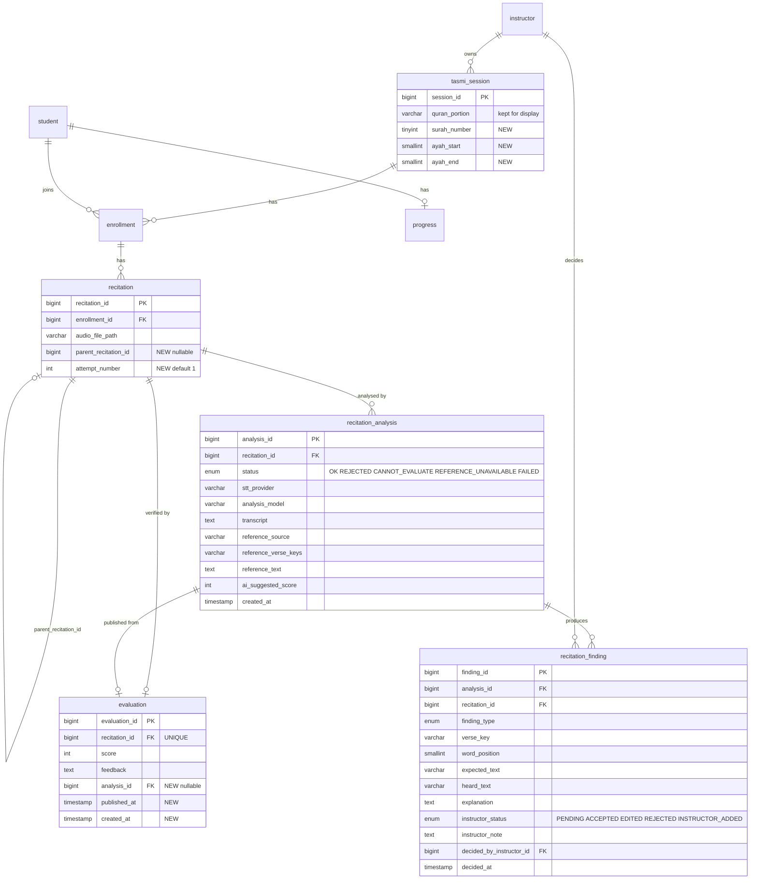

> **Historical document.** This audit describes the repository **before** the Learning Loop was implemented (2 October 2026). It is not current implementation documentation. For the current system, use the root README, [../README.md](../README.md), [../../architecture/learning-loop.md](../../architecture/learning-loop.md), and [../validation.md](../validation.md).

# PRE-IMPLEMENTATION CRITICAL AUDIT — e-Tasmi AI Learning Loop

Analysis only. No source code, schema, configuration, JSP, CSS, or JS was modified. Nothing was committed or pushed.

Inspection date: 2026-10-02. Repository state: branch `master`, HEAD `26043b1`, baseline tag `baseline-pre-ai-challenge-2026` → `a358719` (untouched).

Reviewed inputs:

1. `documentation/challenge/MASTER_SYSTEM_AUDIT.md` (this repo)
2. Instructor Verification Flow Prototype — `Instructor Verification Flow Prototype (1).zip` (React + Vite + Tailwind, Figma Make export, 9 screens)
3. `src/imports/e-Tasmi-AI-Challenge-Figma-Final-Refinement-Prompt.md` (UI refinement specification, inside the prototype)
4. `src/imports/e-Tasmi-Challenge-Figma-Design-Brief.md`
5. `e-Tasmi_AI_Learning_Loop.pptx` (10-slide final presentation)
6. `documentation/challenge/development-plan.md`, `validation.md`, `contribution-log.md`
7. Actual repository: Java services, servlets, DAOs, SQL schema, `DBSeeder`, JSP, JS, CSS, Docker, `web.xml`

Evidence labels: **VERIFIED IN CODE**, **PROTOTYPE ONLY**, **DOC ONLY**, **UNKNOWN — NOT VERIFIED**.

No secrets are printed. Configuration variables are named only.

---

## Executive Summary

**The loop you designed is buildable on this codebase, but the plan as written carries two avoidable third-party risks and one correctness bug that must not be ported from the prototype.**

What is genuinely in place: a working submit → analyze → score → student-result path; an OpenAI transcription + JSON analysis service that already emits missing / incorrect / extra word lists; a live-verified Quran Foundation client that can return authoritative Uthmani text by verse key; browser recording with `MediaRecorder`; Cloudinary-or-local audio storage; role-based access control; and an additive-migration mechanism (`DBSeeder.ensureColumn`) that makes the new schema low-risk.

What does not exist anywhere in the repository: persistence of AI findings, per-finding verification, verse-keyed passages, learning focus, attempt lineage, ElevenLabs, Quranpedia. The challenge is therefore an integration-and-persistence project, not a greenfield one. That is good news for a three-day window.

The five conclusions that should change the plan:

1. **Quranpedia is the single largest unverified dependency and it is not required by any submission material.** There is no Quranpedia code, no verified endpoint, no documented authentication, and no rate-limit information. Meanwhile the Figma refinement specification itself prints `Source: Quran Foundation` as the trusted-reference label, and the presentation only says "trusted Qur'an reference source" generically. Recommendation: implement a `TrustedReferenceProvider` interface with Quran Foundation as the shipping provider (reusing the already live-verified client without touching the student library), store `reference_source` on every analysis, and treat Quranpedia as a later pluggable provider. This keeps attribution honest, satisfies "AI does not generate Qur'an text", and removes a hard blocker from Day 1.

2. **ElevenLabs Scribe v2 should be optional and behind a provider flag, not a Day-1 dependency.** OpenAI transcription already works in this codebase. The exact Scribe v2 model identifier, endpoint, request shape, and whether it accepts the `audio/webm;codecs=opus` blobs that `recitation-studio.js` produces are **UNKNOWN — NOT VERIFIED** here. Build `SpeechToTextProvider` with the existing OpenAI implementation as default and ElevenLabs as a second implementation selected by configuration. If the vendor integration slips, the loop still ships.

3. **The prototype silently converts PENDING findings to ACCEPTED in two places. This directly violates the core product rule and must not be ported.** See `src/App.tsx` lines 119–123 (`handleSaveEvaluation` maps every `pending` finding to `accepted`) and lines 152–154 (`studentFindings` maps `pending` to `accepted` whenever the evaluation is not yet verified, so the student screen renders unverified AI findings). The server must enforce the gate, not a disabled button.

4. **Structured findings should be computed deterministically in Java from the trusted reference, with the model supplying only explanation and summary.** The existing LLM output returns word *lists* with no positions, so it cannot produce stable finding identities, cannot be re-rendered reliably, and cannot be unit-tested without the API. The service already contains `tokenizeArabic`, `normalizeArabic`, and `compareTokens` (used today only as a fallback). Promoting that diff to the primary finding generator gives you verse keys, token positions, reproducibility, testability for all six validation cases, and a much smaller hallucination surface.

5. **Arabic normalization is a correctness requirement, not polish.** The prototype's own sample data demonstrates the failure: finding #2 is labelled a *Makhraj Error* where expected `ٱلصِّرَٰطَ` and heard `ٱلصِّرَاطَ` differ only by superscript alef versus plain alef — an orthographic variant between the Uthmani mushaf and ASR output, not a pronunciation error. Comparing trusted Uthmani text against an ASR transcript without normalising diacritics, alef and hamza forms, and tatweel will manufacture false findings on every single recitation.

One more consequence that is easy to miss: `ProgressDaoJdbc.computeCompletionRate` averages `evaluation.score` across *all* of a student's recitations. The moment Practice Again creates additional scored attempts, every existing progress figure changes meaning. That is a product decision, not a bug, but it must be decided before coding.

Verdict: **the architecture is sound in shape and weak in two of its named dependencies.** With Quran Foundation as the reference provider and OpenAI retained as the default speech provider, Day 1 and Day 2 are realistic. With Quranpedia and ElevenLabs both as hard Day-1 requirements, the three-day schedule is not realistic.

---

## Current System Reality

### Request path (VERIFIED IN CODE)

Browser → `CharacterEncodingFilter` (`/*`, UTF-8) → `UrlLocalizationFilter` (strips `/en`, `/ar`, `/ms`) → `AuthFilter` (`/student/*`, `/instructor/*`, `/admin/*`, `/jsp/*`, `/notifications`, `/live/*`) → `@WebServlet` controller → service → JDBC DAO (`PreparedStatement`) → MySQL → JSP forward.

Java 17 compiled by `javac` inside the Dockerfile into `ROOT.war`; Tomcat 9.0 (`tomcat:9.0-jdk17-temurin`); Servlet 3.1; MySQL 8.4 locally. No Maven/Gradle, no test tree, no `railway.toml`. Schema is created by `SchemaBootstrap` from `WEB-INF/db/railway_schema.sql` when `user` is missing, then reconciled column-by-column by `DBSeeder`.

### Documentation versus code disagreements

| Claim | Source | Actual code behaviour | Classification |
|---|---|---|---|
| Trusted reference source is **Quranpedia** | this task brief, section 5 | No occurrence of `quranpedia` anywhere in Java, JSP, JS, YAML, SQL, or Markdown | Planned, not designed against a verified API |
| Trusted reference label is **`Source: Quran Foundation`** | Figma refinement spec §6, prototype `InstructorReview.tsx` line 164 | Quran Foundation client exists and was live-verified for verse `2:1` and `2:1–2:5` | Prototype and spec contradict the task brief; the prototype matches what the code can actually do today |
| **ElevenLabs Scribe v2** performs speech-to-text | task brief §5, deck slide 7 ("AI comparison against the reference") | Transcription is OpenAI `/v1/audio/transcriptions`; no ElevenLabs reference exists | Not implemented |
| Prototype shows **Makhraj / Tajweed** findings produced by AI | `data.ts` finding #2, `types.ts` `FindingType` | The Java system prompt rule 9 explicitly forbids asserting tajwīd verdicts from a transcript and requires "unverified" phrasing | Prototype contradicts the stricter existing backend rule. The backend is right |
| Edit Finding lets the instructor modify expected and heard text | refinement spec §13 | `EditFindingModal.tsx` exposes only type, ayah, corrected description, instructor note; expected and heard are read-only | Spec not implemented in prototype |
| Add Instructor Finding captures expected and heard text | refinement spec §12 | `AddFindingModal.tsx` sends `expected: ''`, `heard: ''` | Spec not implemented in prototype |
| Challenge validation results | `documentation/challenge/validation.md` | All six rows are `TODO` / `Not run` | Honest placeholder, correctly not pre-filled |
| Development plan Day 1–3 | `documentation/challenge/development-plan.md` | Explicitly labelled "PLANNED WORK, not completed work" | Accurate |
| Success measures in deck slide 9 | presentation | `evaluation` has **no timestamp column at all**, so "time from instructor review to learning focus" is currently unmeasurable | Target is not instrumentable without schema change |

### Challenge-period change already on master

`EMAIL_VERIFICATION_ENABLED` defaults to false (`util.EmailVerificationConfig`, commit `31f2fd9`). Students register straight to `ACTIVE`; instructors still require admin approval. This is a challenge-copy convenience and is not part of the learning loop.

---

## Existing Features

**A. Implemented and on the live path (VERIFIED IN CODE)**

| Capability | Entry point | Service | Tables |
|---|---|---|---|
| Registration, login, logout, password reset | `RegisterServlet`, `LoginServlet`, `LogoutServlet`, `ForgotPasswordServlet`, `ResetPasswordServlet` | `RegistrationService`, `AuthService` | `user`, `student`, `instructor`, `password_reset` |
| Role and approval gating | `AuthFilter` | — | `user.role`, `instructor.verification_status` |
| Admin instructor approval | `InstructorVerificationServlet` | `InstructorVerificationService` | `instructor`, `user`, `audit_log` |
| Session creation with Zoom | `InstructorSessionsServlet` | `TasmiSessionService`, `ZoomApiClient` | `tasmi_session` |
| Enrollment and payment | `StudentSessionsServlet`, `StudentPaymentsServlet`, `StudentQrPaymentServlet` | enrollment / payment services | `enrollment`, `payment`, `payment_verification_history` |
| Recitation record-or-upload | `StudentRecitationServlet` + `recitation-studio.js` | `RecitationService.submit` | `recitation` |
| Audio storage | `CloudinaryUtil` when configured, else `LocalFileUtil` under `ETASMI_UPLOADS_DIR` | — | `recitation.audio_file_path` |
| Owner-checked audio streaming | `StudentRecitationAudioServlet`, `UploadedFileServlet` | — | — |
| Instructor evaluation | `InstructorEvaluationServlet` | `EvaluationService.evaluate` | `evaluation`, `progress` |
| Student result and progress | `recitation-studio.js` feedback modal, `StudentProgressServlet` | `ProgressService` | `evaluation`, `progress` |
| Qur'an library (chapters, verses, search, tafsir, translation, reciter audio) | `StudentQuranLibrary*` servlets | `quran.*` services | none |

**B. Partial or off the evaluation path**

- `recitation_submissions` + `RecitationSubmissionService`: a separate studio workflow with `topic_text`, `language_id`, `PENDING`/`EVALUATED`. The instructor evaluation screen does **not** read it. Easy to confuse with `recitation`; do not build on it.
- `#recFbAi` / `#recFbAiBody` in `student/recitations.jsp`: a hidden "AI insights" block. `recitation-studio.js` never populates it. It is a ready-made insertion point for the Verified Learning Focus.
- `recitation-studio.js` posts a `duration` field that the `recitation` table cannot store.

---

## Existing AI Capabilities

All of the following is in `model/service/RecitationAiAnalysisService.java` (VERIFIED IN CODE).

**Transcription.** `POST https://api.openai.com/v1/audio/transcriptions`, multipart, `language=ar`, `response_format=json`, `temperature=0`, plus a generic Arabic prompt that does **not** include the assigned passage. Model resolution: `OPENAI_RECITATION_MODEL` → default constant `gpt-4o-transcribe`. Docker Compose injects `whisper-1` as its default, so the effective model in the container is whichever the environment supplies.

**Analysis.** `POST https://api.openai.com/v1/chat/completions`, `temperature=0`, `top_p=1`, `seed=1234567`, `response_format={"type":"json_object"}`. Model resolution: `OPENAI_EVALUATOR_MODEL` → `OPENAI_CLASSIFIER_MODEL` → default `gpt-4o`.

**Guardrails already present, and they are better than the prototype implies.**

- Rule 5 is titled "CHOOSING THE REFERENCE TEXT for the diff (NEVER recite Quran from memory)". When the passage matches, the model must copy the expected text verbatim. When the passage does not match but the audio is Qur'an, the model may evaluate against the Qur'anic text of what was actually recited **only if it is 100% certain**, otherwise it must fall back to the expected passage and rely on the mismatch flag.
- Rule 9 forbids any tajwīd verdict derived from a transcript, requires acoustic observations to be phrased as "unverified … requires acoustic review", and says to leave `pronunciation_notes` empty when in doubt.
- A "ZERO-GUESSING CONTRACT" forbids flagging a word as incorrect when the difference is plausibly an ASR artifact.

**Operational limits.** `MIN_MEDIA_BYTES` 4 KB → `REJECTED` as too short. `MAX_MEDIA_BYTES` 25 MB → `FAILED`. `CONNECT_TIMEOUT` 15 s, `REQUEST_TIMEOUT` 90 s. `NON_QURAN_REJECTION_CONFIDENCE` 0.85 with no detected passages required before declaring non-Qur'an audio. Missing `OPENAI_API_KEY` → `FAILED`.

**Deterministic fallback.** If the chat call fails, `buildFallbackResult` runs `compareTokens(tokenizeArabic(expected), tokenizeArabic(transcript))` and emits a local word diff with the note "AI evaluator unavailable — showing a local word-diff only."

**Output object `AnalysisResult`.** `status` (`OK`, `REJECTED`, `CANNOT_EVALUATE`, `FAILED`), `reason`, `transcript`, `expectedText`, `referenceText`, `accuracyPercent`, `score`, `correctWords`, `missingWords`, `incorrectWords` as `expected -> heard` in `replacedWords`, `extraWords`, `pronunciationNotes`, `summary`, `feedback`, `matchedPassageNote`, `matchesExpectedPassage`, `mixedPassages`, `detectedPassages`, `isQuranConfidence`.

**Three hard limitations.**

1. Expected text is the free-text `tasmi_session.quran_portion VARCHAR(150)` — a label such as "Surah Al-Baqarah 1–20", not mushaf text. The diff is therefore frequently a comparison between a label and a recitation.
2. The result lives only in `HttpSession` under `etasmi.aiAnalysis.{recitationId}` plus a per-forward request attribute. `doGet` never reloads it, so a refresh loses the report; saving the evaluation calls `removeAttribute` and discards it permanently.
3. Word lists carry no positions, no verse keys, and no identities, so nothing can be addressed, verified, or audited per finding.

---

## Challenge Requirements

From the presentation and the refinement specification, the contract is:

1. Audio is transcribed.
2. The comparison reference is authoritative and attributable, never model-generated.
3. The model produces **structured, individually addressable** findings that are explicitly advisory.
4. The instructor decides Accept / Edit / Reject per finding and may add findings the model missed.
5. Nothing reaches the student until the instructor publishes.
6. Only accepted, edited, and instructor-added findings become the Verified Learning Focus.
7. The student sees a verified score, instructor feedback, and a concrete practice list, then presses Practice Again on the same passage.
8. The new attempt retains the context of the previous one.
9. Safe failure is mandatory: if the trusted reference is unavailable, the comparison is withheld and no Qur'an text is invented (deck slide 7, spec §16); if the audio cannot be reliably matched, findings are withheld (spec §17).
10. Both instructor and student screens are full-page desktop applications with proper Arabic RTL typography and integrated ayah markers (spec §1, §6, §7, §25, §26).
11. Nineteen named screens and states, including the two safe-failure states (spec §33).
12. No new unrelated features: no analytics, gamification, payment or Zoom UI, admin screens (spec §29).

---

## Existing vs Planned vs Missing Comparison

| Capability | Status | Current behaviour | Files / classes | Tables | APIs | Missing | Risk |
|---|---|---|---|---|---|---|---|
| Audio capture and upload | **A. Exists** | `MediaRecorder` prefers `audio/webm;codecs=opus`, falls back to ogg/opus then mp4; AJAX multipart with `enrollmentId`, `audio`, `duration` | `recitation-studio.js`, `StudentRecitationServlet`, `RecitationService` | `recitation` | — | Nothing for the loop | Low |
| Audio storage and playback | **A. Exists** | Cloudinary if configured, else local volume; owner-checked streaming | `CloudinaryUtil`, `LocalFileUtil`, `StudentRecitationAudioServlet` | `recitation` | Cloudinary | Nothing | Low |
| Speech-to-text | **A. Exists (OpenAI)** | `/v1/audio/transcriptions`, Arabic | `RecitationAiAnalysisService.transcribeAudio` | — | OpenAI | ElevenLabs Scribe v2 provider | Medium — vendor contract unverified |
| Trusted reference retrieval | **D. Designed, not wired** | QF client can fetch `text_uthmani` by verse key; recitation analysis never calls it | `QuranFoundationClient`, `QuranLibraryVersesService.fetchVerseByKey` / `fetchPage` | — | Quran Foundation | Verse-keyed passage on the session; a reference service for recitation | Medium |
| Structured findings | **C. Partially derivable** | Unpositioned word lists in memory | `RecitationAiAnalysisService`, `AnalysisResult` | — | OpenAI | Finding identity, type, location, status, persistence | High — core of the challenge |
| Finding persistence | **E. Missing** | Session attribute only, deleted on save | `InstructorEvaluationServlet` | — | — | Two new tables | Medium |
| Accept / Edit / Reject | **E. Missing** | Only Analyze and Save Evaluation exist | `evaluations.jsp`, `InstructorEvaluationServlet` | — | — | Per-finding POST actions and server-side gate | High |
| Publication gate | **E. Missing** | Save writes `evaluation` immediately; no published state | `EvaluationService.evaluate` | `evaluation` | — | `published_at` and a pending-findings check | High — product rule |
| Verified Learning Focus | **E. Missing** | Student sees score and feedback only | `recitation-studio.js`, `recitations.jsp` `#recFbAi` | `evaluation` | — | Projection over verified findings and a student view | Medium |
| Practice Again lineage | **E. Missing** | Each submit inserts an unrelated `recitation` row | `RecitationService.submit` | `recitation` | — | `parent_recitation_id`, `attempt_number` | Medium |
| Safe-failure states | **C. Partial** | Status enum covers short audio, empty transcript, API failure; no "reference unavailable" state because no reference is fetched | `RecitationAiAnalysisService` | — | — | `REFERENCE_UNAVAILABLE` status and UI | Medium |
| Arabic RTL UI | **A. Exists** | `ar.json` locale, `UrlLocalizationFilter`, UTF-8 JSP config, `etasmi-i18n.css` | `web/assets/locales/ar.json`, `web/css/etasmi-i18n.css` | — | — | Qur'an-grade typography and ayah markers on the new panels | Low |
| Automated tests | **E. Missing** | No test sources at all | — | — | — | Everything | Medium for a reliability claim |

---

## Architecture Assessment

**The proposed pipeline is sound in shape.** Audio → transcript → trusted reference → comparison → findings → human verification → learner focus is the right decomposition, and it maps cleanly onto the existing servlet/service/DAO layering. Two changes make it materially more reliable.

**Change 1 — put the comparison in Java, not in the model.** The proposal implies the model produces the findings. Deriving them in Java from the trusted reference gives:

- stable `verse_key` + `word_position` for every finding, which is what makes a finding addressable and therefore verifiable;
- reproducibility independent of model version, which the current code already tries to buy with `seed=1234567` but cannot guarantee across model upgrades;
- unit-testable validation cases — all six scenarios can be tested with fixed strings and no API key;
- a far smaller hallucination surface: the model never decides *whether* a word is missing, only how to explain it.

Use the model for `explanation`, `summary`, student-facing `feedback`, passage identification, and the non-Qur'an / mismatch judgement. Keep `pronunciation_notes` as advisory-only, exactly as rule 9 already demands.

**Change 2 — introduce two narrow provider interfaces and nothing else.** `SpeechToTextProvider` (OpenAI today, ElevenLabs optional) and `TrustedReferenceProvider` (Quran Foundation today, Quranpedia optional). Both selected by a configuration variable with the working implementation as default. This is the smallest abstraction that protects the three-day schedule from two unverified vendors, and it keeps the existing student Qur'an library completely untouched — the new reference service is a separate class that merely reuses the authenticated client.

**What I would not do.** Do not introduce React, Vite, or a build step; the prototype is a visual reference only. Do not add an orchestration layer, queue, or background worker — analysis is instructor-triggered and synchronous today, and a 90-second timeout inside a request is already the established behaviour. Do not create a separate microservice for the comparison.

**One architectural wrinkle worth naming.** Analysis is currently synchronous inside a POST with a 90 s HTTP timeout on the upstream call. Adding a reference fetch in front of it adds another network hop. Fetch the reference once when the session passage is saved, or cache it per session, rather than on every analyze. The QF client already caches its OAuth token (`clearCachedToken` exists), so only the verse payload needs caching.

---

## AI Pipeline Assessment

### Where audio enters, lives, and is read

Entry: `StudentRecitationServlet` multipart POST `/student/recitations` (page JS sends `ajax=1`). Validation is largely by accepted extension list in the JSP (`.webm,.mp3,.wav,.m4a,.ogg,.oga,.aac,.mp4,.mov,audio/*,video/*`) and by the servlet's multipart limits; the JSP advertises up to 200 MB while the AI service refuses anything over 25 MB. Storage: Cloudinary when all three `CLOUDINARY_*` variables are set, otherwise local disk under `ETASMI_UPLOADS_DIR`. Retrieval for analysis: `InstructorEvaluationServlet` resolves the stored path or URL and refuses with "Recitation media is unavailable for AI analysis. Use a valid upload URL or local /uploads file." when it cannot.

### Current lifecycle, precisely

1. Instructor opens `/instructor/evaluations` (GET) — no analysis is loaded, ever.
2. Instructor POSTs `action=analyze&recitationId=N`. Ownership is checked by scanning `recitationDao.listForInstructor`. If `quran_portion` is blank the request is refused before any API call.
3. Transcription, then chat analysis, then `AnalysisResult`.
4. Result is written to `HttpSession` key `etasmi.aiAnalysis.N` and to request attribute `analysisByRecitationId`, then forwarded to `evaluations.jsp`.
5. Instructor POSTs `action=save` with a typed score and feedback. `EvaluationService.evaluate` validates 0–100, instructor `APPROVED`, ownership, and no existing evaluation, inserts one `evaluation` row, upserts `progress`, commits, and the servlet removes the session attribute and redirects to `?saved=1`.
6. Student's feedback modal shows score and feedback. `#recFbAi` stays hidden.

### Limitations that the challenge must fix

| Limitation | Consequence |
|---|---|
| Reference is a 150-character label | The diff is often meaningless; "missing words" can be an artefact of comparing against a title |
| Findings are unpositioned strings | Cannot be addressed, verified, or audited individually |
| No persistence | Refresh loses the report; saving destroys it; no history; no reproducibility evidence |
| Score is typed by hand with the AI score shown nearby | Acceptable and correct for authority, but there is no record of what the AI suggested versus what the instructor decided |
| One `evaluation` row per recitation, enforced by `UNIQUE KEY uq_evaluation_recitation` | No publish/unpublish, no revision, no second opinion |
| `evaluation` has no timestamp | The deck's "time from review to learning focus" metric is unmeasurable |
| Analysis cannot be triggered by the student | Correct for the product rule, and should stay that way |

---

## Trusted Reference Assessment

### What exists (VERIFIED IN CODE, live-verified 2026-09-28)

`QuranFoundationConfig` reads `QF_ENV`, `QF_CLIENT_ID`, `QF_CLIENT_SECRET`, `QF_API_ENDPOINT`, `QF_AUTH_ENDPOINT`, `QF_OAUTH_SCOPE` (default scope `content`), `QF_SEARCH_API_BASE`. `QuranFoundationClient` obtains a token via `POST {oauth}/oauth2/token` with Basic client credentials and caches it; content requests send `x-auth-token` and `x-client-id` headers, not a bearer token. `QuranLibraryVersesService` exposes `fetchVerseByKey(verseKey, …)` against `/content/api/v4/verses/by_key/{key}`, `fetchPage(chapter, page, perPage, …)` and `fetchMergedChapter(...)` against `/content/api/v4/verses/by_chapter/{n}`, plus `sanitizeVerseKey` and `validateChapter` input guards. `QuranVersesParse` maps upstream `text_uthmani` into the app field `textArabic`.

A live check against the production hosts returned HTTP 200 for the token, HTTP 200 for verse `2:1` with Arabic in `text_uthmani`, and `2:1`–`2:5` via `by_chapter` with `per_page=5`. There is **no** range endpoint; a passage must be assembled from paged `by_chapter` results or repeated `by_key` calls.

### Assessment of the proposed design

**Database representation.** Add `surah_number TINYINT UNSIGNED`, `ayah_start SMALLINT UNSIGNED`, `ayah_end SMALLINT UNSIGNED` to `tasmi_session` and keep `quran_portion` for display and backward compatibility. Store the resolved reference **on the analysis row**, not on the session: `reference_source`, `reference_verse_keys`, `reference_text`, `reference_fetched_at`. Rationale: the mushaf text for a verse does not change, but the *provenance of this particular comparison* must be frozen with the analysis for traceability, and a session can be edited after an analysis has run.

**Retrieval and caching.** Fetch when the instructor saves the passage, cache in memory keyed by `surah:start-end`, and re-fetch lazily if the cache is cold at analyze time. Qur'an text is immutable, so cache invalidation is a non-problem. This avoids per-analysis latency and reduces rate-limit exposure. Rate limits for the QF content API are **UNKNOWN — NOT VERIFIED**; the caching design makes that acceptable.

**Integrity of Arabic text.** Use `text_uthmani` as the trusted script. Do **not** use `text_qpc_hafs` blindly: for `2:1` it embeds an ayah-number glyph, which would corrupt a token diff. Store the retrieved text verbatim and never mutate it; normalise only a derived copy used for comparison.

**Protection against AI-generated Qur'an text.** Two layers. Architectural: the reference is a stored, source-attributed string, and the comparison runs in Java against that string. Prompt-level: keep rule 5, and tighten it so that when the reference is unavailable the model is not asked to diff at all. The system must return `REFERENCE_UNAVAILABLE` and withhold findings, exactly as deck slide 7 promises.

**Failure handling.** `QuranFoundationClient.getJson` throws `IOException` with the status code and no secret material. Map that to a distinct analysis status, surface the spec §16 state ("Trusted Reference Unavailable … AI comparison has been withheld … No Qur'an text was generated by AI"), and allow the instructor to continue with manual evaluation and instructor-added findings. Blocking the instructor entirely would be worse than degrading gracefully.

**Passage mismatch.** Keep it independent from the non-Qur'an judgement, as the current prompt already does correctly. Mismatch should become a first-class finding type with no word-level children, because word-level diffing against the wrong passage produces noise.

### Quranpedia — the critical recommendation

Nothing in the repository, the prototype, the refinement specification, or the presentation requires the name Quranpedia; the specification in fact prints `Source: Quran Foundation`. Its API surface, authentication model, licensing, availability, and rate limits are **UNKNOWN — NOT VERIFIED**. Making it a Day-1 dependency puts the central guarantee of the submission — "religious content stays traceable to an approved source" — behind an unvalidated vendor.

Recommendation: ship Quran Foundation behind `TrustedReferenceProvider`, store `reference_source` per analysis so the provenance is explicit and future-proof, and add Quranpedia later as a second provider if and only if its contract is verified. This neither replaces nor modifies the existing student library — it reuses the authenticated client from a new, separate service.

---

## Speech Recognition Assessment

**ELEVENLABS — NOT CURRENTLY IMPLEMENTED.** No occurrence in Java, JSP, JS, YAML, SQL, Markdown, or `.env.example`.

What must be verified before any code is written (all **UNKNOWN — NOT VERIFIED** from this repository):

1. The exact Scribe v2 model identifier and endpoint path, and whether v2 is generally available for batch file transcription as opposed to realtime streaming.
2. Whether it accepts `audio/webm;codecs=opus`, which is what `recitation-studio.js` produces by preference, plus the ogg/opus and mp4 fallbacks and the uploaded formats the dropzone allows.
3. File-size and duration ceilings versus the existing 25 MB guard.
4. Whether diacritics are returned for Arabic. This matters enormously: a transcript with diacritics diffed against undiacritised normalisation is fine, but a transcript *without* diacritics compared against `text_uthmani` requires the normalisation layer to be correct.
5. Word-level timestamps. If Scribe returns them, they are genuinely valuable — a finding could carry an audio offset so the instructor can jump to the exact moment. That is the strongest argument for ElevenLabs and it should be the deciding factor, not brand preference.
6. Pricing, rate limits, and data-retention policy, since student audio is personal data.

**Recommendation.** Implement `SpeechToTextProvider` with `OpenAiSpeechToTextProvider` (lifted from the existing private method, no behaviour change) and `ElevenLabsSpeechToTextProvider`, chosen by a new configuration variable with OpenAI as the default. Persist `stt_provider` and `stt_model` on the analysis row for auditability. If ElevenLabs is adopted, keep OpenAI as an automatic fallback on failure so a vendor outage degrades rather than breaks. Do not make the loop depend on it.

---

## Structured Findings Assessment

### What the current output can and cannot support

| Required field | Today | Note |
|---|---|---|
| Finding ID | **Missing** | Nothing is persisted, so nothing has an identity |
| Recitation ID | Available contextually | Only as a session-key suffix |
| Finding type | Implicit | Encoded by which list a word landed in |
| Expected text | Partially | `replacedWords` holds `expected -> heard`; missing/extra lists hold a bare word |
| Heard text | Partially | Same |
| Location / ayah | **Missing** | No verse key, no token index |
| Explanation | **Missing per finding** | Only a global `summary` and `feedback` |
| AI status / confidence | Global only | `isQuranConfidence`, `matchesExpectedPassage` are per-analysis |
| Instructor status | **Missing** | No concept exists |
| Instructor edit | **Missing** | — |
| Reference source | **Missing** | `referenceText` exists but with no provenance |
| Evidence | **Missing** | No audio offset, no token span |
| Timestamps | **Missing** | Not even on `evaluation` |

### Recommended finding model

Types: `MISSING_WORD`, `INCORRECT_WORD`, `EXTRA_WORD`, `PASSAGE_MISMATCH`, `PRONUNCIATION_OBSERVATION`, `OTHER`. Use a MySQL `ENUM` so bad values cannot be inserted, and accept that adding a type later is an `ALTER`.

Statuses, kept as two independent columns:

- `ai_status`: `PROPOSED` for model-generated findings, `NOT_APPLICABLE` for instructor-added ones.
- `instructor_status`: `PENDING`, `ACCEPTED`, `EDITED`, `REJECTED`, `INSTRUCTOR_ADDED`.

Two columns rather than one shared field is the right call: it preserves the original AI proposal next to the human decision, which is exactly what the Edit modal already shows as "Original AI Finding — Read Only" and what any audit of "AI assists, instructor certifies" requires.

Keep the AI text immutable and store instructor changes in separate columns (`instructor_expected_text`, `instructor_heard_text`, `instructor_explanation`, `instructor_note`). Never overwrite the model's words — the difference between proposal and decision is the evidence that verification happened.

`instructor_note` is the only field that should be labelled "shown to student", matching the prototype's own labelling.

### Critical issue: the prototype's finding types invite unverifiable claims

`types.ts` offers `Makhraj Error`, `Tajweed Error`, and `Pronunciation` as AI finding types, and `data.ts` ships a seeded AI *Makhraj Error* whose only evidence is `ٱلصِّرَٰطَ` versus `ٱلصِّرَاطَ` — superscript alef versus plain alef, an orthographic variant, not an articulation defect. That finding is a false positive produced by comparing mushaf orthography to ASR output. The Java prompt already forbids exactly this class of claim. Keep the backend rule and restrict AI-generated acoustic findings to a single advisory type that is clearly marked as requiring audio verification; leave `Makhraj` and `Tajweed` as instructor-added types, where a human has actually listened.

### Critical issue: Arabic normalisation

Comparison must run on a normalised copy: strip harakat and superscript alef, unify alef forms (`ا أ إ آ ٱ`), unify hamza carriers and ya/alef maqsura, unify ta marbuta where appropriate, strip tatweel and Qur'anic pause marks, and collapse whitespace. Display must always use the original strings. `normalizeArabic` and `tokenizeArabic` already exist in `RecitationAiAnalysisService`; they must be reviewed against real `text_uthmani` before being trusted, because they were written for label-versus-transcript comparison, not mushaf-versus-ASR comparison. Without this, every validation case except "reference unavailable" will produce false findings.

---

## Instructor Verification Assessment

### The auto-accept defect — confirmed, with locations

The prototype contains two code paths that silently convert `pending` to `accepted`:

```tsx
// src/App.tsx, handleSaveEvaluation
// Auto-accept any remaining pending findings
setFindings((prev) =>
  prev.map((f) => (f.status === 'pending' ? { ...f, status: 'accepted' } : f))
)
```

```tsx
// src/App.tsx, student view
const studentFindings = isVerified
  ? findings
  : findings.map((f) => (f.status === 'pending' ? { ...f, status: 'accepted' as const } : f))
```

The first makes publication an implicit blanket approval. The second is worse: it renders unverified AI findings on the student screen whenever the prototype is opened directly on the student flow, which is exactly the outcome the project promises cannot happen. Both are prototype navigation conveniences, and both must be deliberately **not** carried into the implementation. In the real system there is no need for either: findings reach the student only by being read back from the database with a verified status.

The prototype's good parts, which should be preserved: the Proceed button is disabled while `pendingCount > 0`; the progress banner states "n of m verified"; rejected findings are visibly dimmed and labelled "Excluded from Learning Focus"; the publish confirmation modal states what the student will receive; the Edit modal shows the original AI finding read-only beside the instructor's correction.

### Where the gate belongs in the real code

Client-side disabling is not a gate. `EvaluationService.evaluate` must refuse to publish when any finding for that recitation has `instructor_status = 'PENDING'`, inside the existing transaction, returning a failure message the servlet already knows how to display. That single server-side check is the actual product rule. Everything in the JSP is an affordance.

### Conflicts with current behaviour that must be resolved

1. `evaluation` has `UNIQUE KEY uq_evaluation_recitation` and `evaluate` explicitly refuses a second save ("This recitation has already been evaluated."). The prototype's "re-edit" affordance on accepted findings implies post-publication revision. Decide: either verification decisions freeze at publish, or add an explicit unpublish/revise path. The former is simpler and defensible for a three-day build.
2. Ownership is currently checked by listing every recitation for the instructor and scanning it. The new per-finding endpoints will be called many times per review; add a direct ownership query rather than reusing the list scan.
3. The existing `mark_reviewed` / `reopen` session-level actions are not verification and should not be conflated with it in the UI.

---

## Verified Learning Focus Assessment

**Recommendation: do not create a `learning_focus` table.** The focus is a projection: the accepted, edited, and instructor-added findings of the published analysis for a recitation, ordered by verse key and token position. The prototype already models it exactly this way in `components/focus.ts`, which filters on `accepted | edited | instructor-added`. Persisting a duplicate copy introduces a second source of truth that can drift from the findings it was derived from, for no benefit, since publication freezes the findings anyway.

Persist only what the projection cannot derive: a per-finding practice hint if instructors want to author one (`instructor_note` already covers it) and the publication timestamp on `evaluation`.

**Generation logic.** Read findings where `recitation_id = ?` and `instructor_status IN ('ACCEPTED','EDITED','INSTRUCTOR_ADDED')` and the parent `evaluation.published_at IS NOT NULL`. Map each to a learner-facing item: verse label, type phrased in plain language, the expected phrase in Arabic, and the instructor note when present. The prototype's `ACTIONS` map in `focus.ts` is a reasonable starting vocabulary for the action sentence.

**Two prototype bugs to avoid porting.** `getFocusItems` sets `phrase: f.expected`, but `AddFindingModal` creates instructor-added findings with `expected: ''`, so an instructor-added item renders with an empty Arabic phrase. And `AddFindingModal` derives its id from `findings.length + 1`, which collides as soon as findings are added more than once. In the real system ids come from the database; the empty-phrase case must be handled either by making expected text a required field on instructor-added findings or by rendering the ayah text instead.

**Relationship to evaluation.** The focus is visible to the student if and only if `evaluation.published_at` is set. That single column is what makes "nothing reaches the learner without approval" enforceable in a query rather than in UI logic.

**Relationship to practice attempts.** The next attempt should display the parent attempt's focus. Because the focus is a projection of the parent's findings, the child attempt needs only `parent_recitation_id` — no copying of focus items. This is both simpler and more honest: the learner sees the actual verified findings they are practising against.

---

## Student Learning Loop Assessment

### What exists today

The student recitation page already has: record-or-upload with `MediaRecorder`, live timer, waveform-ish UI, playback review, re-record and delete, AJAX submission, a history list with per-row audio, and a feedback modal with a pending state and a result state showing score and feedback. It also has a hidden, empty `#recFbAi` / `#recFbAiBody` block. This is substantially more than the prototype assumes, and the Practice Again screen can be built by reusing `recitation-studio.js` rather than writing a new recorder.

### What is missing

- No passage context on the student side beyond the session title; `quran_portion` is a label.
- No learning focus display.
- No Practice Again entry point, and no notion that one attempt follows another.
- No full-page result view; the result is a modal. The refinement specification asks for a full-page student result screen (§18–§22), which is a new JSP rather than a modal change.
- `MIN_SECONDS = 5` client-side guard in the prototype has no server-side equivalent beyond the AI service's 4 KB floor.

### Honest assessment of the proposed student experience

The design is appropriate: a verified score, instructor feedback in the instructor's own words, a short list of concrete practice items with the Arabic phrase, and one dominant Practice Again action. It correctly hides the AI pipeline from the learner. Three refinements I would insist on:

1. Show attempt lineage plainly — "Attempt 2 of this passage" with a link to the previous result. The prototype hardcodes "Attempt 2" as a label; real lineage makes the loop legible.
2. Handle the empty-focus case properly. The prototype does this well already ("Beautiful recitation. There is nothing specific to correct…"), and that state must survive into the real UI, because a correct recitation is validation case 1.
3. Never show the student a pending or withheld analysis as though it were a result. If the instructor has not published, the student sees the existing pending state and nothing else.

---

## Database Gap Analysis

### Current tables relevant to the loop (VERIFIED IN CODE)

```
tasmi_session(session_id PK, instructor_id FK, title, description, level, session_date,
              session_time, duration_minutes, quran_portion VARCHAR(150), mode, fee,
              capacity, live_*, zoom_*, status, evaluation_reviewed_at)

enrollment(enrollment_id PK, student_id FK, session_id FK, enrollment_status,
           UNIQUE(student_id, session_id))

recitation(recitation_id PK, enrollment_id FK, audio_file_path VARCHAR(255),
           submission_date TIMESTAMP DEFAULT CURRENT_TIMESTAMP)

evaluation(evaluation_id PK, recitation_id FK UNIQUE, instructor_id FK,
           score INT CHECK 0..100, feedback TEXT)      -- no timestamps, no state

progress(student_id PK, completion_rate)               -- AVG(evaluation.score)
```

`recitation` has no passage, no duration, no attempt lineage. `evaluation` has no timestamp and no publication state. Nothing in the schema can hold a transcript, a reference, or a finding.

### Required additions

**1. `tasmi_session` — structured passage (additive, nullable).**

| Column | Type | Purpose |
|---|---|---|
| `surah_number` | `TINYINT UNSIGNED NULL` | 1–114 |
| `ayah_start` | `SMALLINT UNSIGNED NULL` | first ayah |
| `ayah_end` | `SMALLINT UNSIGNED NULL` | last ayah |

Keep `quran_portion` for display and for every existing session row. Validate `surah_number` and the ayah range against the bundled catalogue (`QuranBundledCatalog`) or `QuranLibraryVersesService.validateChapter` before saving.

**2. `recitation_analysis` — one row per analysis run.**

| Column | Type | Purpose |
|---|---|---|
| `analysis_id` | `BIGINT UNSIGNED PK` | |
| `recitation_id` | `BIGINT UNSIGNED FK → recitation` | cascade delete |
| `status` | `ENUM('OK','REJECTED','CANNOT_EVALUATE','REFERENCE_UNAVAILABLE','FAILED')` | includes the new safe-failure state |
| `status_reason` | `VARCHAR(500) NULL` | |
| `stt_provider`, `stt_model` | `VARCHAR(60)` | audit of which vendor produced the transcript |
| `analysis_model` | `VARCHAR(60)` | |
| `transcript` | `TEXT NULL` | |
| `reference_source` | `VARCHAR(60) NULL` | e.g. `QURAN_FOUNDATION` |
| `reference_verse_keys` | `VARCHAR(255) NULL` | e.g. `2:1-2:5` |
| `reference_text` | `TEXT NULL` | verbatim trusted text actually diffed |
| `matches_expected_passage` | `TINYINT(1) NULL` | |
| `accuracy_percent` | `DECIMAL(5,2) NULL` | |
| `ai_suggested_score` | `INT NULL` | preserves AI-versus-instructor distinction |
| `ai_summary` | `TEXT NULL` | |
| `created_at` | `TIMESTAMP DEFAULT CURRENT_TIMESTAMP` | enables the deck's timing metric |

Keeping this as its own table (rather than columns on `recitation`) gives analysis **history** for free, which the challenge's reliability story needs, and keeps re-analysis from destroying prior evidence. Index `(recitation_id, created_at)`.

**3. `recitation_finding` — one row per finding.**

| Column | Type | Purpose |
|---|---|---|
| `finding_id` | `BIGINT UNSIGNED PK` | the addressable identity |
| `analysis_id` | `BIGINT UNSIGNED FK → recitation_analysis` | cascade |
| `recitation_id` | `BIGINT UNSIGNED FK → recitation` | denormalised for the student query; justified |
| `finding_type` | `ENUM('MISSING_WORD','INCORRECT_WORD','EXTRA_WORD','PASSAGE_MISMATCH','PRONUNCIATION_OBSERVATION','OTHER')` | |
| `verse_key` | `VARCHAR(12) NULL` | `2:4` |
| `word_position` | `SMALLINT UNSIGNED NULL` | token index within the verse |
| `expected_text`, `heard_text` | `VARCHAR(255) NULL` | AI values, immutable |
| `explanation` | `TEXT NULL` | AI explanation, immutable |
| `ai_status` | `ENUM('PROPOSED','NOT_APPLICABLE') DEFAULT 'PROPOSED'` | |
| `ai_confidence` | `DECIMAL(4,3) NULL` | |
| `instructor_status` | `ENUM('PENDING','ACCEPTED','EDITED','REJECTED','INSTRUCTOR_ADDED') DEFAULT 'PENDING'` | the gate |
| `instructor_expected_text`, `instructor_heard_text` | `VARCHAR(255) NULL` | edits, never overwriting AI values |
| `instructor_explanation` | `TEXT NULL` | |
| `instructor_note` | `TEXT NULL` | the only student-visible instructor text per finding |
| `decided_by_instructor_id` | `BIGINT UNSIGNED NULL FK → instructor` | |
| `decided_at` | `TIMESTAMP NULL` | |
| `created_at` | `TIMESTAMP DEFAULT CURRENT_TIMESTAMP` | |

Index `(recitation_id, instructor_status)` for the student focus query and `(analysis_id)` for the review screen.

**4. `evaluation` — publication state.**

| Column | Type | Purpose |
|---|---|---|
| `analysis_id` | `BIGINT UNSIGNED NULL FK → recitation_analysis` | which analysis this evaluation verified |
| `published_at` | `TIMESTAMP NULL` | the authority boundary; student sees nothing until set |
| `created_at` | `TIMESTAMP DEFAULT CURRENT_TIMESTAMP` | fixes the missing-timestamp gap |

**5. `recitation` — attempt lineage.**

| Column | Type | Purpose |
|---|---|---|
| `parent_recitation_id` | `BIGINT UNSIGNED NULL FK → recitation` | `ON DELETE SET NULL` to avoid cascade chains |
| `attempt_number` | `INT UNSIGNED NOT NULL DEFAULT 1` | denormalised for display |

Do **not** add a practice-items table. The child attempt's practice context is the parent's verified findings, reachable through `parent_recitation_id`.

### What I deliberately do not recommend

- No `learning_focus` table (projection, as argued above).
- No `ai_prompt_log` table. Prompt text is in source control and the model name is on the analysis row; logging full prompts adds storage and privacy surface for little gain in three days.
- No normalisation of findings into a separate `finding_word` table. One row per finding is the right grain.
- No change to `recitation_submissions`, `payment`, `attendance`, `session_material`, or any Zoom column.

### Migration risks

| Risk | Detail | Mitigation |
|---|---|---|
| Two schema sources | `setup/railway_schema.sql` and `web/WEB-INF/db/railway_schema.sql` must stay identical, and `etasmi_schema.sql` is the Docker-init variant with `CREATE DATABASE` | Update all three deliberately; `SchemaBootstrap` reads the `WEB-INF` copy |
| Existing databases | Local challenge DB has data; the Railway DB state is **UNKNOWN — NOT VERIFIED** (previously observed with a partial 16-table import) | Use the established `DBSeeder.ensureColumn` / `ensureIndex` pattern plus a new `module_*_patch.sql`, so startup is idempotent on both fresh and existing databases |
| `ENUM` rigidity | Adding a finding type later requires `ALTER` | Accept it; the six types are defined by the challenge |
| `evaluation` unique constraint | Blocks re-publication | Decide the revision policy before coding, not during |
| Progress semantics | `computeCompletionRate` averages all scores; practice attempts will shift every student's figure | Explicit product decision; see Critical Decisions |
| `audio_file_path VARCHAR(255)` | Long Cloudinary URLs or future signed URLs could truncate | Not a challenge blocker; note it |

---

## API Integration Assessment

### ElevenLabs — Scribe v2 (planned)

| Aspect | Assessment |
|---|---|
| Purpose | Arabic speech-to-text for recitation |
| Request flow | Would replace `transcribeAudio` behind `SpeechToTextProvider` |
| Authentication | Vendor API key via a new configuration variable, read with `System.getenv` like every other integration; **never** hardcoded |
| Configuration | Add `STT_PROVIDER`, `ELEVENLABS_API_KEY`, `ELEVENLABS_STT_MODEL` to `.env.example` with empty values |
| Error handling | Must map transport, non-2xx, and empty-transcript outcomes to the existing `CANNOT_EVALUATE` / `FAILED` statuses |
| Timeout / retry | Reuse the existing 15 s connect / 90 s request budget. One retry at most, only on connect failure; never retry a 4xx |
| Rate limiting | **UNKNOWN — NOT VERIFIED** |
| Caching | Transcript is cached by being persisted on `recitation_analysis`; never re-transcribe the same audio for the same analysis |
| Privacy | Sends student voice to a new processor. This is a new data flow and must be documented |
| Fallback | OpenAI transcription, already implemented |

### Quranpedia — trusted reference (planned)

| Aspect | Assessment |
|---|---|
| Purpose | Trusted Qur'an reference for the challenge comparison |
| Request flow | Would sit behind `TrustedReferenceProvider` |
| Authentication, endpoints, data shape, licensing, rate limits, availability | **UNKNOWN — NOT VERIFIED.** No code, no documentation in this repository |
| Caching | Mandatory; Qur'an text is immutable |
| Failure handling | Must produce `REFERENCE_UNAVAILABLE` and withhold comparison |
| Recommendation | Not a Day-1 dependency. Ship Quran Foundation, record `reference_source`, add Quranpedia as a second provider after its contract is verified |

### OpenAI — analysis (existing, keep)

Already correct in shape: `temperature=0`, `top_p=1`, fixed `seed`, `response_format=json_object`, strict schema in the user prompt, defensive parsing (`asString`, `asDouble`, `asBool`, `asStringList`), and a deterministic local fallback. Changes needed: feed it the trusted reference instead of the free-text label, stop asking it to produce the word diff, and have it return per-finding explanations keyed to the Java-computed findings. Keep rules 5 and 9 verbatim; they are the strongest safety text in the codebase.

### Quran Foundation — existing library (do not modify)

Token caching and header auth already work and were live-verified. The challenge must reuse `QuranFoundationClient` from a **new** reference service and must not change `QuranLibraryVersesService` behaviour, its servlets, or `quran-library.js`. Note the absence of a verse-range endpoint: assemble ranges from `by_chapter` paging or repeated `by_key`.

### Cloudinary and local storage (existing, keep)

No change required. The AI service already reads from both an HTTP URL and a local `/uploads` path.

---

## Security & Privacy Assessment

Only items that bear on the challenge feature.

| Area | Finding | Classification |
|---|---|---|
| API keys | All integrations read `System.getenv`; `.env` is gitignored; `.env.example` holds placeholders | NOT AN ISSUE — maintain the pattern for any new key |
| Git history | Whether `.env` was ever committed historically was not re-verified | UNKNOWN — NOT VERIFIED |
| CSRF | No token mechanism found anywhere; `AuthFilter` is authentication and role only | **CONFIRMED ISSUE, directly relevant.** Accept / Edit / Reject / Publish are new state-changing POSTs that will alter what a learner is told. At minimum they must be POST-only, same-origin checked, and idempotent per finding |
| XSS | Findings will carry free text from the model and the instructor and will render in JSP; `recitations.jsp` already uses an `esc()` helper and the pattern must be followed for every new output | **POTENTIAL ISSUE, high relevance** |
| SQL injection | DAOs use `PreparedStatement` throughout the code inspected | NOT FOUND |
| Instructor ownership | Enforced, but by scanning `listForInstructor`; per-finding endpoints need a direct ownership check including `finding → analysis → recitation → enrollment → session → instructor` | POTENTIAL ISSUE if a new endpoint trusts `findingId` alone |
| Student ownership | `StudentRecitationAudioServlet` verifies the caller owns the recitation | NOT AN ISSUE |
| New student endpoints | A learning-focus endpoint must filter by the student's own enrollment and by `published_at IS NOT NULL` | Must be designed in, not added later |
| Path traversal | `..` rejected on upload paths | PARTIAL mitigation, unchanged |
| Cloudinary object ACL | Whether stored audio is publicly reachable by URL | UNKNOWN — NOT VERIFIED |
| Session fixation | Login invalidates the previous session | NOT AN ISSUE |
| Session timeout | No `<session-config>` in `web.xml` | UNKNOWN — NOT VERIFIED (container default). Relevant because analysis state currently lives in the session; persistence removes that dependency |
| Logging | Services log at WARNING/SEVERE with user and recitation identifiers; transcripts should not be logged | POTENTIAL ISSUE — do not log transcript or audio bytes |
| Third-party transmission | Audio to OpenAI today; audio to ElevenLabs if adopted; verse keys only to the reference provider — no personal data | Document the ElevenLabs flow before enabling it |
| New personal data | Transcript and findings become persistent records of a learner's voice and mistakes, where previously they were ephemeral | Privacy-relevant by design. Decide retention, and state it in documentation |

---

## UI/UX Assessment

### Stack reality check

The prototype is React + Vite + Tailwind. The application is JSP with hand-written CSS in `web/css/*.css`. **However**, `jsp/instructor/evaluations.jsp` already loads Tailwind via the Play CDN with preflight disabled, and `home.jsp` does too. So Tailwind utility classes can be used on the instructor review page without introducing a new stack or build step — the prototype's markup can be adapted rather than re-derived. The student pages do **not** load Tailwind and should keep using the existing design-system CSS. Do not introduce React, Vite, or a bundler.

### Instructor review page

The prototype's information architecture is good and I would keep it: identity + passage + audio in one header strip; a two-column evidence region with the transcript on one side and the trusted reference on the other; a compact advisory AI summary; a progress line; then findings as the primary work area with per-finding Accept / Edit / Reject.

Changes I would insist on:

1. **Evidence hierarchy must put audio first, not the transcript.** The instructor's authority comes from listening. The transcript is derived evidence, and the trusted reference is the authority for text. Visually the audio player should be at least as prominent as the transcript panel.
2. **Mark the AI suggested score as non-binding at the point of decision**, not only in the summary strip. The prototype's "This replaces the AI suggested score" caption is good; keep it adjacent to the score control.
3. **Make the Edit modal able to correct expected and heard text.** The refinement specification requires it and the prototype omits it. An instructor who cannot correct the text can only re-describe a wrong finding.
4. **Require expected text (or auto-fill it from the reference) for instructor-added findings**, otherwise the student's focus item has no Arabic phrase.
5. **Add a per-finding evidence affordance** — jump audio playback to the relevant position if the STT provider gives word timestamps. If it does not, say so rather than implying precision.
6. **Pronunciation findings must be visually distinct and labelled advisory/unverified**, matching the backend's rule 9 wording. Do not let a transcript-derived acoustic claim look like a textual fact.
7. **Design the two safe-failure panels now** (reference unavailable, recitation unverifiable). They are listed in the specification and they are the two states most likely to appear in a live demo.
8. Accessibility: the prototype uses `role="dialog"`, `aria-modal`, `aria-live`, and focus-visible rings in places. Carry that through, add keyboard operability for Accept/Edit/Reject, and ensure status is conveyed by text, not colour alone (red-on-dim for rejected is currently colour-dependent).
9. Cognitive load: three findings look comfortable; twenty will not. Add grouping by verse and a collapsed state for resolved findings.

### Student result page

The prototype's student screens are the stronger half of the design: one verified score, instructor words attributed to a named instructor, a short focus list with the Arabic phrase, the passage shown as real Qur'an text, and a single dominant Practice Again button. It correctly omits the AI pipeline.

Changes I would make:

1. Replace the "Verified" badge's implicit meaning with one plain sentence: reviewed and approved by the named instructor. Badges alone do not teach trust.
2. Show real attempt lineage instead of a hardcoded "Attempt 2".
3. Keep the empty-focus state exactly as designed; it is validation case 1.
4. The full-page student result is a new JSP; the existing feedback modal should remain for quick history browsing rather than being deleted.
5. RTL: the Arabic locale already exists (`ar.json`, `etasmi-i18n.css`). The new panels must be checked in Arabic UI, not only with Arabic content inside an English UI — these are different problems and the specification's §26 only addresses typography.

### Qur'an typography

The specification is right that a numbered list is wrong. Use continuous Uthmani text with integrated ayah markers. Two practical notes: `text_uthmani` is the correct source field, and `text_qpc_hafs` must not be used as a drop-in because it can embed the ayah-number glyph. Whether a suitable Qur'anic webfont is already bundled in this repository is **UNKNOWN — NOT VERIFIED**; if none is, pick one with a clear licence before the demo.

---

## Reliability & Safe-Failure Assessment

Recommended behaviour for each case. "Findings withheld" means no findings are created or displayed; "review allowed" means the instructor may still evaluate manually.

| # | Case | Analysis status | Findings | Instructor review | Student feedback | UI state |
|---|---|---|---|---|---|---|
| 1 | Correct recitation | `OK` | Zero findings persisted | Allowed; publishes with empty focus | Score + feedback + "nothing specific to correct" | Empty-focus state |
| 2 | Missing word | `OK` | One `MISSING_WORD` with verse key and position | Required | Focus item after approval | Normal |
| 3 | Incorrect word | `OK` | One `INCORRECT_WORD` with expected and heard | Required | Focus item after approval | Normal |
| 4 | Extra word | `OK` | One `EXTRA_WORD` | Required | Focus item after approval | Normal |
| 5 | Passage mismatch | `OK` with `matches_expected_passage = false` | A single `PASSAGE_MISMATCH` finding; **no word-level findings** | Required | Only after approval | Prominent mismatch banner |
| 6 | Trusted reference unavailable | `REFERENCE_UNAVAILABLE` | **Withheld** | Allowed, manual only | Only from manual evaluation | Spec §16 panel, explicitly stating no Qur'an text was generated |
| 7 | Silence / empty transcript | `CANNOT_EVALUATE` | Withheld | Allowed | None until instructor acts | Spec §17 panel |
| 8 | Very short audio (< 4 KB today) | `REJECTED` | Withheld | Allowed | Ask the student to resubmit | Clear, non-punitive message |
| 9 | Noisy audio / poor transcription | `OK` but low confidence | Generated, but low-confidence findings should be visually flagged | Required | Only approved items | Confidence hint on findings |
| 10 | Non-Qur'an Arabic | `REJECTED` when confidence ≥ 0.85 with no detected passages | Withheld | Allowed | None | Spec §17 panel |
| 11 | Non-Arabic speech | Same as 10 | Withheld | Allowed | None | Same |
| 12 | STT timeout or failure | `FAILED` | Withheld | Allowed | None | Retry affordance |
| 13 | Analysis API failure | Currently falls back to a local word diff | **Recommend: persist the diff findings but mark the analysis as degraded**, so the instructor knows explanations are templated | Required | Only approved items | Degraded-mode notice |
| 14 | Malformed AI JSON | Treated as evaluator failure → fallback | Same as 13 | Required | Only approved items | Degraded-mode notice |
| 15 | Reference provider outage | → case 6 | Withheld | Allowed | None | Spec §16 panel |

Two deliberate positions. First, **withholding must be a stored status, not an absence of data** — otherwise "no findings" and "findings withheld" look identical to the UI and to the next engineer. Second, **the instructor must never be blocked** by an AI or vendor failure; manual evaluation with instructor-added findings has to remain fully available, because a teacher who cannot grade is a worse outcome than a missing AI report.

The current system already handles 7, 8, 10, 11, 12, 13, and 14 in some form. It cannot represent 6 or 15 at all, because it never fetches a reference. That is the single most important reliability gap relative to the promise on deck slide 7.

---

## Reuse vs New Development

| Existing component | Reuse? | Required modification | Reason |
|---|---|---|---|
| `RecitationAiAnalysisService` | **Yes, extend** | Accept an injected trusted reference instead of reading `quran_portion`; promote `compareTokens` to primary finding generation; return structured findings with verse keys; add `REFERENCE_UNAVAILABLE`; extract transcription behind a provider interface | Contains all the hard-won guardrails, timeouts, limits, JSON defensiveness, and Arabic tokenisation. Rewriting it would discard the safest code in the repository |
| `RecitationService` | **Yes, extend** | Set `parent_recitation_id` and `attempt_number` on practice submissions | Submission rules (approved enrollment, payment, session state) are already correct and must not be duplicated |
| `EvaluationService` | **Yes, extend** | Add the server-side pending-findings gate; set `published_at` and `analysis_id`; decide the revision policy | Already transactional with ownership and approval checks and progress upsert |
| `InstructorEvaluationServlet` | **Yes, extend** | Reload persisted analysis on GET; add `accept_finding`, `edit_finding`, `reject_finding`, `add_finding`, `publish` actions; stop relying on the session attribute | Routing, ownership, and error-forwarding conventions are established here |
| `jsp/instructor/evaluations.jsp` | **Yes, adapt** | Add the two-column evidence region, per-finding controls, progress, modals, and the two safe-failure panels | Tailwind Play CDN is already loaded on this page, so prototype markup can be adapted directly |
| `QuranFoundationClient` | **Yes, reuse unchanged** | None | Token caching and header auth are live-verified |
| `QuranLibraryVersesService` | **Yes, call, do not modify** | None — add a new `RecitationReferenceService` that calls it | Keeps the existing library and the challenge reference layer separate, as required |
| `QuranVersesParse` | **Yes, reuse** | None | Already prefers `text_uthmani` |
| `CloudinaryUtil` / `LocalFileUtil` / `UploadedFileServlet` | **Yes, reuse unchanged** | None | Audio storage and retrieval already work for both modes |
| Authentication, `AuthFilter`, roles, instructor approval | **Yes, reuse unchanged** | None | Out of challenge scope; changing it risks the whole platform |
| `recitation-studio.js` | **Yes, extend** | Pre-select the passage and parent attempt for Practice Again; optionally populate `#recFbAi` | The recorder, timer, playback, re-record, and AJAX upload already exist |
| `student/recitations.jsp` + `#recFbAi` | **Yes, extend** | Render verified focus items | A ready-made, already-styled insertion point |
| `ProgressDaoJdbc.computeCompletionRate` | **Review, likely modify** | Decide whether practice attempts count toward completion rate | Practice Again silently changes the meaning of every existing progress figure |
| `DBSeeder.ensureColumn` / `ensureIndex` | **Yes, reuse** | Add the new columns and indexes through it | Idempotent additive migration on fresh and existing databases, matching the repository's own convention |
| `setup/module_*_patch.sql` convention | **Yes, follow** | Add one new patch file | Consistent with how `evaluation_reviewed_at`, profile images, and payments were introduced |
| `recitation_submissions` studio workflow | **No** | None | Separate, not on the evaluation path. Building on it would fragment the data model |
| Zoom, payments, admin, notifications | **No change** | None | Explicitly out of scope |

---

## Risks and Technical Debt

| Risk | Severity | Note |
|---|---|---|
| Quranpedia contract unknown | **High** | Can block the central guarantee. Mitigated entirely by provider abstraction with QF shipping |
| ElevenLabs Scribe v2 contract unknown, including whether it accepts webm/opus | **High** | Mitigated by provider abstraction with OpenAI default |
| Arabic normalisation errors between Uthmani script and ASR output | **High** | Will manufacture false findings on every recitation if wrong. Needs fixtures and tests, not eyeballing |
| AI-asserted tajwīd/makhraj findings | **High** for credibility | Backend already forbids it; the prototype reintroduces it. Keep the backend rule |
| No automated tests anywhere | **Medium-High** | The challenge claims reliability testing. Without fixtures the six cases can only be demonstrated manually |
| Auto-accept logic in the prototype | **High** if ported | Two exact locations identified |
| `evaluation` unique constraint vs revision | **Medium** | Needs an explicit policy decision |
| Progress metric semantics change | **Medium** | Silent behavioural regression for existing users |
| Synchronous analysis inside an HTTP request | **Medium** | Reference fetch adds latency; mitigate with caching, not with a queue |
| CSRF absent platform-wide | **Medium** | New verification endpoints are exactly the kind of action that matters |
| XSS through finding text rendered in JSP | **Medium** | Escape every new output |
| Three copies of the schema file | **Medium** | Drift risk during migration |
| Railway database state unknown | **Medium** | Verify before relying on it for a demo |
| Tailwind only on specific pages | **Low-Medium** | Fine for the instructor page; do not spread it to student pages mid-challenge |
| No session timeout configured | **Low** | Less relevant once analysis is persisted |
| `audio_file_path VARCHAR(255)` | **Low** | Watch if signed URLs are introduced |
| Prototype id generation and empty expected text | **Low** | Do not port; database ids and required fields solve both |

---

## Recommended Implementation Phases

Dependency-ordered. Each phase is independently demonstrable.

### Phase 0 — Schema and architecture foundation

- **Objective:** every new table, column, and index exists and is idempotent on fresh and existing databases.
- **Files:** `setup/railway_schema.sql`, `web/WEB-INF/db/railway_schema.sql`, `setup/etasmi_schema.sql`, a new `setup/module_ai_learning_loop_patch.sql`, `src/java/setup/DBSeeder.java`.
- **Database:** `tasmi_session` passage columns; `recitation_analysis`; `recitation_finding`; `evaluation.analysis_id`, `published_at`, `created_at`; `recitation.parent_recitation_id`, `attempt_number`.
- **APIs:** none.
- **Risks:** schema drift across the three SQL copies.
- **Acceptance:** container restarts cleanly on an existing database and on an empty one; all new columns present; no existing behaviour changes.
- **Tests:** start against the populated local DB; start against a fresh volume; confirm login, submit, analyze, and save still work.

### Phase 1 — Structured passage and trusted reference

- **Objective:** a session carries surah and ayah range; the trusted Arabic text is retrievable and attributable.
- **Files:** `InstructorSessionsServlet`, `jsp/instructor/sessions.jsp`, `TasmiSession` entity and DAO, new `TrustedReferenceProvider` + `QuranFoundationReferenceProvider` + `RecitationReferenceService`.
- **APIs:** Quran Foundation Content API (existing client).
- **Dependencies:** Phase 0.
- **Risks:** no range endpoint; paging logic; validation of surah/ayah bounds.
- **Acceptance:** saving a session with surah 1 ayah 1–7 yields the seven Uthmani verses with `reference_verse_keys = 1:1-1:7` and `reference_source = QURAN_FOUNDATION`; a forced provider failure yields a clean `REFERENCE_UNAVAILABLE` with no invented text.
- **Tests:** `1:1–1:7`, `2:1–2:5`, a cross-page range, an invalid surah, an inverted range, provider down.

### Phase 2 — Deterministic comparison and structured findings

- **Objective:** findings are computed in Java from the trusted text with verse keys and token positions; the model only explains.
- **Files:** `RecitationAiAnalysisService` (normalisation, tokenisation, diff, finding construction, prompt adjustment), new finding model classes.
- **Dependencies:** Phase 1.
- **Risks:** Arabic normalisation; alignment quality for long passages.
- **Acceptance:** the five text-based validation cases produce exactly the expected finding types and counts from fixed transcript fixtures, with **no API key required** for the diff portion.
- **Tests:** identical text; one word removed; one word substituted; one word duplicated; wrong surah entirely; orthographic-variant-only difference must produce **zero** findings.

### Phase 3 — Persistence and reload

- **Objective:** analysis and findings survive refresh, save, and re-analysis.
- **Files:** new `RecitationAnalysisDao`, `RecitationFindingDao`, `InstructorEvaluationServlet` (`doGet` reload, remove session-attribute reliance), `evaluations.jsp`.
- **Dependencies:** Phases 0 and 2.
- **Risks:** duplicate analyses on repeated clicks; keep history rather than overwriting.
- **Acceptance:** analyze, refresh, and the report is still there; re-analyze creates a second analysis row and the newest is shown; saving no longer destroys anything.

### Phase 4 — Instructor verification gate

- **Objective:** Accept / Edit / Reject / Add per finding, and publication blocked while anything is pending.
- **Files:** `InstructorEvaluationServlet` new actions, `EvaluationService.evaluate` gate plus `published_at`, `evaluations.jsp` controls and modals.
- **Dependencies:** Phase 3.
- **Risks:** CSRF and ownership on the new endpoints; XSS on instructor text; the auto-accept temptation.
- **Acceptance:** publishing with one pending finding is refused **by the server** even if the button is forced; a rejected finding never appears downstream; the original AI text remains visible beside every edit.
- **Tests:** publish with pending; publish all-accepted; reject everything; edit then publish; add an instructor finding; attempt to act on another instructor's finding.

### Phase 5 — Verified Learning Focus and student result

- **Objective:** the student sees a verified score, feedback, and the focus list — only after publication.
- **Files:** new student result JSP, `StudentRecitationServlet` or a new servlet, `recitation-studio.js`, `#recFbAi`, `ar.json`.
- **Dependencies:** Phase 4.
- **Acceptance:** before publication the student sees only the pending state; after publication the focus shows exactly the accepted, edited, and instructor-added findings in verse order; zero verified findings renders the positive empty state.

### Phase 6 — Practice Again loop

- **Objective:** a linked second attempt on the same passage.
- **Files:** `RecitationService.submit`, `recitation-studio.js`, student result and recitations JSP.
- **Dependencies:** Phase 5.
- **Risks:** the progress-metric decision; enrollment and payment rules must still be enforced for the new attempt.
- **Acceptance:** Practice Again creates a recitation with `parent_recitation_id` set and `attempt_number = parent + 1`, the same session passage, and the parent's focus visible while recording; the instructor sees it as a new recitation to review.

### Phase 7 — Reliability and edge cases

- **Objective:** every row of the reliability table behaves as specified and is evidenced.
- **Files:** analysis service statuses, both safe-failure panels, `validation.md`.
- **Dependencies:** Phases 2–6.
- **Acceptance:** all fifteen cases reproduced and recorded with evidence; no case produces findings from an unavailable reference.

### Phase 8 — UI polish, Arabic and RTL, responsive

- **Objective:** full-page layouts, Qur'an typography with ayah markers, Arabic UI review, tablet and mobile behaviour, loading and error states.
- **Dependencies:** Phases 4–6.
- **Acceptance:** instructor review and student result reviewed in Arabic UI as well as English; no layout breakage at tablet width; every state in specification §28 reachable.

### Phase 9 — Validation, demo and evidence

- **Objective:** `validation.md` filled from actual runs, `contribution-log.md` updated, demo script, screenshots.
- **Acceptance:** six challenge cases plus the extra failure cases recorded with real outcomes; no invented results.

### Phases that can safely be combined

- 0 + 1 (schema and reference land together naturally).
- 3 + 4 (persistence is only observable through the verification UI).
- 5 + 6 (both are student-side and share the same JSP work).
- 7 + 8 can run in parallel if two work streams exist; otherwise 7 first, because correctness evidence matters more than polish.

Phase 2.5, optional and non-blocking: the ElevenLabs provider behind `STT_PROVIDER`, only if the vendor contract is verified and OpenAI remains the fallback.

---

## Day 1 / Day 2 / Day 3 Plan

### Is the published schedule realistic?

**As written, no. With two scope decisions, yes.**

The stated Day 1 is "trusted reference integration, persist structured AI findings, Accept / Edit / Reject". That is Phases 0 through 4 — five phases including two new database tables, a new reference layer, a rewritten comparison, a new DAO pair, and a new interactive review UI, in a single day, on a codebase with no test harness. If "trusted reference" also means integrating an unverified Quranpedia API, and if speech-to-text is simultaneously being migrated to an unverified ElevenLabs model, Day 1 cannot hold.

Two decisions make the schedule achievable:

1. Trusted reference = Quran Foundation (already live-verified), behind a provider interface with `reference_source` persisted.
2. Speech-to-text stays OpenAI for the challenge; ElevenLabs is optional and additive.

With those, the realistic mapping is:

| Day | Phases | Deliverable | Must be true at end of day |
|---|---|---|---|
| **Day 1** | 0, 1, 2, 3 | Trusted verse-keyed reference, deterministic structured findings, persisted analysis and findings that survive refresh | Analyze a real recitation against `1:1–1:7`; refresh; the findings are still there with verse keys and the source recorded |
| **Day 2** | 4, 5, 6 | Verification gate, publication state, Verified Learning Focus, student result, Practice Again lineage | Publishing with a pending finding is refused server-side; a rejected finding never reaches the student; Practice Again creates a linked attempt |
| **Day 3** | 7, 8, 9 | Reliability cases, safe-failure panels, Arabic/RTL review, responsive pass, demo, evidence | All six challenge cases plus reference-unavailable recorded with real evidence in `validation.md` |

### Recommended re-ordering versus the published plan

Move "structured findings" earlier than "trusted reference integration UI work" only in the sense that the comparison engine should be built and tested against fixtures before it is wired to a live API. Concretely: write the diff and normalisation with hardcoded Uthmani strings first (minutes, no network), then connect the provider. This front-loads the riskiest correctness work into the cheapest test loop and is the single biggest schedule saver available.

Also move the two safe-failure panels from Day 3 into Day 2. They are demo-critical and they are trivial once the status enum exists; leaving them to Day 3 risks demonstrating only the happy path.

---

## Definition of Done

The challenge contribution is complete when all of the following are true and evidenced.

**Functional**

1. A session stores surah and ayah range, and the trusted Arabic text for that range is retrieved from an attributable source and stored verbatim with the analysis.
2. Analysis produces individually identified findings with type, verse key, token position, expected text, heard text, and explanation, persisted in MySQL.
3. Findings survive page refresh, saving, and re-analysis; re-analysis preserves history.
4. Every finding has an independent instructor decision of Accept, Edit, or Reject; instructors can add their own findings.
5. The original AI proposal remains visible and unmodified beside any instructor edit.
6. Publication is refused by the server while any finding is pending.
7. A student sees nothing until `published_at` is set.
8. The Verified Learning Focus contains exactly the accepted, edited, and instructor-added findings — never rejected or pending ones.
9. Practice Again creates a new recitation linked to its parent with the same passage, and the instructor reviews it like any other.
10. When the trusted reference is unavailable, the analysis is stored as `REFERENCE_UNAVAILABLE`, no findings are created, no Qur'an text is generated, and the instructor can still evaluate manually.

**Quality**

11. All six challenge validation cases, plus silence, short audio, non-Qur'an audio, API failure, and reference unavailable, are reproduced and recorded in `validation.md` with real outcomes.
12. Orthographic-variant-only differences produce zero findings.
13. No AI-asserted tajwīd or makhraj verdict is presented as fact; acoustic observations are labelled advisory and requiring audio review.
14. New output is HTML-escaped; new endpoints verify ownership and role.
15. Instructor review and student result are reviewed in Arabic UI and at tablet width.

**Process**

16. No secrets committed; `.env` untouched; the baseline tag unmoved.
17. Feature-level commits with meaningful messages.
18. `contribution-log.md` records what was actually implemented; `development-plan.md` is not rewritten as though planned work were done.
19. Zoom, payments, authentication, admin, and the existing Qur'an library behave exactly as before.

---

## Critical Decisions Required Before Coding

| # | Decision | Options | Recommendation |
|---|---|---|---|
| 1 | Trusted reference provider for the challenge | (a) Quran Foundation now, Quranpedia later behind the same interface; (b) Quranpedia now | **(a).** QF is live-verified, the Figma spec already labels the source as Quran Foundation, and nothing in the submission requires the name Quranpedia |
| 2 | Speech-to-text provider | (a) Keep OpenAI, add ElevenLabs optionally later; (b) Migrate to Scribe v2 now | **(a).** Scribe v2's endpoint, model id, format support, and diacritic behaviour are unverified. Word-level timestamps would be the one strong reason to adopt it, and that should be verified before committing |
| 3 | Who generates findings | (a) Java diff authoritative, model explains; (b) model produces findings | **(a).** Gives positions, reproducibility, testability, and a smaller hallucination surface |
| 4 | Learning focus storage | (a) Projection over verified findings; (b) its own table | **(a).** One source of truth; publication already freezes it |
| 5 | Post-publication revision | (a) Frozen at publish; (b) allow unpublish and revise | **(a)** for a three-day build. `evaluation` already enforces one row per recitation |
| 6 | Do practice attempts count toward `progress.completion_rate` | (a) All attempts (current behaviour); (b) latest attempt per passage only; (c) exclude practice attempts | **(b)** is the most defensible pedagogically, but it is a behavioural change to an existing feature — the decision must be explicit and documented either way |
| 7 | Can a student trigger analysis | (a) No, instructor-only (current); (b) automatic on submit | **(a).** Automatic analysis would put unverified AI output one bug away from the learner |
| 8 | AI-generated pronunciation findings | (a) Single advisory type, clearly unverified; (b) full makhraj/tajweed taxonomy as in the prototype | **(a).** The backend prompt already forbids (b), and (b) is the fastest way to lose credibility with instructors |
| 9 | Scope of the new student result page | (a) New full-page JSP plus keep the existing modal; (b) replace the modal | **(a).** Lower regression risk |
| 10 | Tailwind on new pages | (a) Instructor page only, where the CDN already exists; (b) adopt more broadly | **(a).** Do not change the styling strategy of the platform mid-challenge |
| 11 | Retention of transcripts and findings | Decide and document | Persisting a learner's voice-derived mistakes is new personal data; state the retention position before shipping |
| 12 | Railway database state | Verify before demo | Current contents are **UNKNOWN — NOT VERIFIED** |

---

## Recommended Implementation Order

1. Decide items 1, 2, 3, and 6 above. Nothing else should start first.
2. Phase 0 schema through `DBSeeder.ensureColumn` plus the SQL files.
3. Arabic normalisation and the token diff, against hardcoded Uthmani fixtures, with no network.
4. Phase 1 reference provider and the session passage fields.
5. Phase 2 wiring: reference into analysis, findings out, prompt reduced to explanation duties.
6. Phase 3 persistence and GET reload.
7. Phase 4 verification endpoints, server-side gate, publication state, instructor UI.
8. Both safe-failure panels.
9. Phase 5 student result and learning focus.
10. Phase 6 Practice Again lineage.
11. Phase 7 reliability evidence.
12. Phase 8 Arabic, RTL, responsive, polish.
13. Phase 9 documentation, demo, evidence.
14. Optional: ElevenLabs provider, only if decision 2 changes and the contract is verified.

### Git and release discipline for implementation

One feature-level commit per phase boundary, for example: `feat: add structured Quran passage to tasmi sessions`, `feat: add trusted Quran reference provider for recitation analysis`, `feat: derive structured recitation findings from trusted reference`, `feat: persist recitation analysis and findings`, `feat: add instructor finding verification gate`, `feat: generate verified learning focus for students`, `feat: link practice attempts to parent recitation`, `test: record recitation analysis validation cases`, `docs: add challenge implementation evidence`.

No `final`, `final2`, `update`, or `fix typo` commits. Never commit `.env` or any key. Do not move `baseline-pre-ai-challenge-2026`. Keep pre-challenge and challenge history clearly separated, and keep documentation labelled Planned / Implemented / Validated / Evidence.

---

## Final Architecture Diagram

```mermaid
flowchart TB
  subgraph Student
    rec[Record or upload - recitation-studio.js]
    result[Verified result and learning focus]
    practice[Practice Again - linked attempt]
  end

  subgraph Server[Tomcat - servlets and services]
    submit[StudentRecitationServlet and RecitationService]
    analyze[InstructorEvaluationServlet action=analyze]
    svc[RecitationAiAnalysisService]
    refsvc[RecitationReferenceService]
    diff[Arabic normalise and token diff in Java]
    verify[Finding verification actions]
    publish[EvaluationService - gate and publish]
    focus[Learning focus projection]
  end

  subgraph Providers
    stt[SpeechToTextProvider - OpenAI default]
    ref[TrustedReferenceProvider - Quran Foundation]
    llm[OpenAI chat - explanations only]
  end

  subgraph DB[(MySQL)]
    t1[recitation and parent lineage]
    t2[recitation_analysis]
    t3[recitation_finding]
    t4[evaluation with published_at]
  end

  rec --> submit --> t1
  analyze --> svc
  svc --> stt
  svc --> refsvc --> ref
  svc --> diff
  diff --> llm
  svc --> t2
  svc --> t3
  verify --> t3
  publish --> t4
  t3 --> focus --> result
  t4 --> result
  result --> practice --> submit
```

Authority boundary: nothing in `recitation_finding` reaches the student unless its `instructor_status` is Accepted, Edited, or Instructor-added **and** the parent `evaluation.published_at` is set.

---

## Final Database / Entity Relationship Recommendation



Three new tables would be two too many; three new *concepts* — analysis run, finding, publication — are exactly right. Everything else is additive nullable columns on existing tables, applied idempotently through the mechanism the repository already uses.

---

## READY TO IMPLEMENT

These are unblocked and can begin as soon as decisions 1, 2, 3, and 6 are made.

1. **Phase 0 schema** — all new tables and columns via `DBSeeder.ensureColumn` / `ensureIndex` plus a new `module_*_patch.sql` and the three schema files.
2. **Arabic normalisation and token diff** against hardcoded Uthmani fixtures — no network, no key, highest correctness value per hour.
3. **Structured passage fields** on `tasmi_session` and the instructor session form, keeping `quran_portion` intact.
4. **Trusted reference service** over the existing, live-verified `QuranFoundationClient` and `QuranLibraryVersesService.fetchVerseByKey` / `fetchPage`, with in-memory caching and `reference_source` persisted.
5. **Analysis and finding persistence** plus GET reload in `InstructorEvaluationServlet`, which also removes the current refresh-loses-everything defect.
6. **Per-finding Accept / Edit / Reject / Add** endpoints and UI on `evaluations.jsp`, where Tailwind is already available.
7. **Server-side publication gate** and `published_at` in `EvaluationService.evaluate`.
8. **Verified Learning Focus** as a projection, rendered into the existing `#recFbAi` block and a new full-page student result JSP.
9. **Practice Again** via `parent_recitation_id` and `attempt_number`, reusing `recitation-studio.js`.
10. **Both safe-failure states**, enabled by the new `REFERENCE_UNAVAILABLE` status.
11. **Validation fixtures** for all six cases plus the orthographic-variant regression case.

## BLOCKERS / DECISIONS REQUIRED

1. **Quranpedia** — no verified endpoint, authentication, licensing, or rate limit exists anywhere in this repository. **Blocker for any Quranpedia-specific work.** Not a blocker for the challenge if decision 1 adopts Quran Foundation behind a provider interface.
2. **ElevenLabs Scribe v2** — model identifier, endpoint, accepted audio formats (notably `audio/webm;codecs=opus`), diacritic output, word timestamps, limits, and retention are all **UNKNOWN — NOT VERIFIED**. **Blocker for provider migration.** Not a blocker for the loop.
3. **Progress metric semantics** (decision 6) — Practice Again changes the meaning of every existing `progress.completion_rate` value. Must be decided before Phase 6.
4. **Post-publication revision policy** (decision 5) — `evaluation` currently permits exactly one row per recitation and `evaluate` refuses a second save. The prototype's re-edit affordance implies otherwise.
5. **Retention policy for transcripts and findings** (decision 11) — new persistent personal data derived from a learner's voice.
6. **CSRF posture for the new verification endpoints** — the platform has no token mechanism; decide the minimum acceptable protection before exposing Accept / Edit / Reject.
7. **Qur'anic webfont licence** — whether a suitable font is already bundled is **UNKNOWN — NOT VERIFIED**; needed for the specification's typography requirement.
8. **Railway database state** — contents and completeness are **UNKNOWN — NOT VERIFIED**; confirm before relying on it for a demo environment.

### Explicitly not to be carried forward from the prototype

- `App.tsx` lines 119–123: auto-accepting pending findings on save.
- `App.tsx` lines 152–154: showing pending findings to the student as accepted.
- AI-generated `Makhraj Error` and `Tajweed Error` finding types.
- `AddFindingModal` creating findings with empty expected and heard text.
- `findings.length + 1` id generation.
- React, Vite, and any build step. The prototype is a visual reference only.

