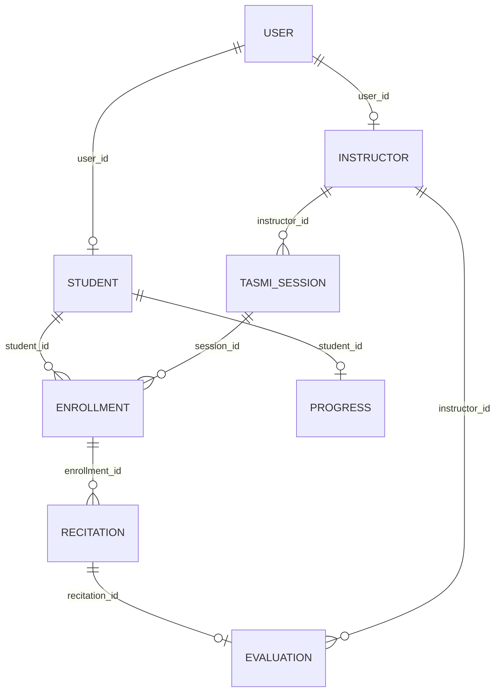
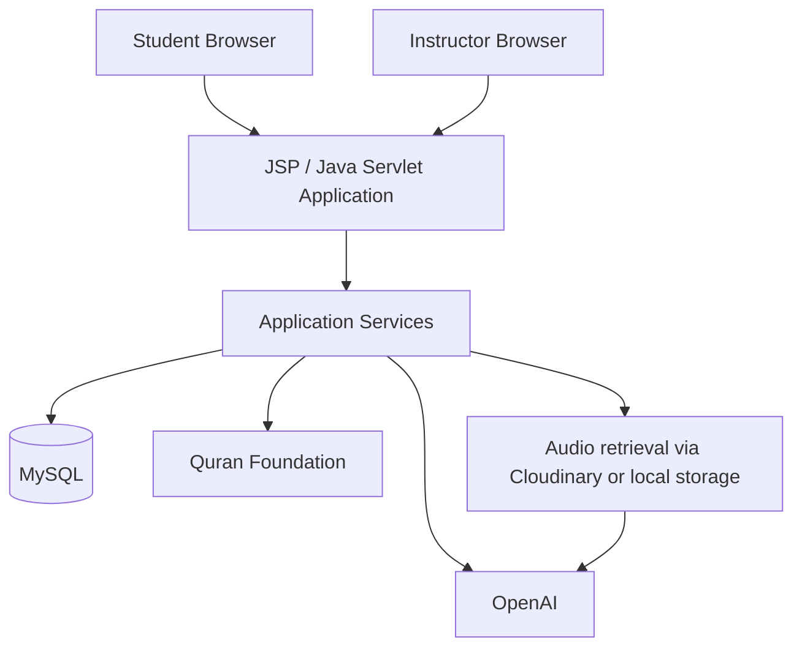

# Pre-Challenge System Architecture

## 1. Purpose

This document describes the technical architecture of the existing e-Tasmi system at the pre-challenge baseline.

It is a functional view of the system represented by baseline commit `a358719`. It does not describe challenge-period architecture as present.

## 2. High-Level Architecture

The existing path is:

Browser → JSP / Java Servlet application → application services → MySQL database → external services where required

The audit confirms these external services:

- OpenAI, for instructor recitation transcription and evaluation, and for separate student assistant features when configured
- Quran Foundation, for Qur'an Library content when configured
- Cloudinary, as one storage path for submitted audio and some other uploads
- Zoom, for optional live sessions when configured

Not every external service is required for every feature. Human enrolment, recitation submission, and instructor scoring can proceed when a given integration is absent. Local `/uploads` storage is the other audio path recorded by the audit.

## 3. Existing Application Layers

The source is a servlet and JSP application with controller, service, and JDBC data-access packages. The audit does not define a separate formal layered framework. The headings below are a functional architecture view of that structure.

### Presentation Layer

- JSP pages
- HTML, CSS, and JavaScript used by those pages

### Application / Request Layer

- Java servlets, including the student recitation servlet and the instructor evaluation servlet

### Service Layer

- Existing application services for sessions, enrolment, recitation submission, and official evaluation
- `RecitationAiAnalysisService` for the instructor-triggered recitation analysis

### Persistence Layer

- MySQL database `etasmi`
- Existing tables, including the entities in section 7

## 4. Existing Recitation Flow

Student → Recitation Submission → Stored Audio → Instructor Evaluation → Optional Instructor AI Analysis → Instructor Review → Official Score and Feedback → Student Result

AI analysis is instructor-triggered in the baseline. The student submits audio. The instructor opens the evaluation, may start analysis, reviews the on-screen result, and then enters the official score and feedback. That saved evaluation is what the student sees. The analysis suggestion is not stored as the official score.

## 5. Existing AI Analysis Flow

Submitted Audio → Audio Retrieval → OpenAI Transcription → AI Evaluation → On-Screen Analysis Result → Instructor Review

The instructor starts this flow from the evaluations page. The service reads the stored media from Cloudinary or from local `/uploads`, requests a transcription, then requests an evaluation. The result is shown on that page. It is not written as a durable structured finding.

The comparison reference is the session's free-text `quran_portion`.

The baseline recitation AI did not use the Qur'an Library verse key as its authoritative comparison reference.

## 6. Existing Qur'an Library Flow

Student → Qur'an Library → Quran Foundation → Qur'an content/reference → Reading / Listening

This path serves the library screens: chapter and verse reference, and reciter listening. It depends on the Quran Foundation integration when that content is loaded. Reciter audio is recorded in the audit as coming from a Qur'an CDN.

This library path is separate from the existing recitation comparison path. Recitation analysis still compares the submission with `quran_portion`.

## 7. Existing Data Relationships

The relationships below are foreign keys in `e-Tasmi/e-Tasmi/setup/etasmi_schema.sql`. Challenge-specific tables are not included. Other baseline tables, such as payment and attendance, exist and are omitted from this diagram.

`student.user_id` and `instructor.user_id` are unique. `enrollment` is unique per student and session. `evaluation.recitation_id` is unique, so there is one official evaluation per recitation, and that row also references the instructor. `progress` uses `student_id` as its primary key. The audit records that progress is updated when an evaluation is saved. The schema does not place a foreign key from `progress` to `evaluation`.

`tasmi_session.quran_portion` is a free-text column on the session. It is not a foreign key to a verse table.

## 8. Existing Architecture Diagram

MySQL stores accounts, sessions, enrolments, recitations, evaluations, and progress. OpenAI is called for instructor transcription and evaluation, and for the separate student assistant features when those features run. Quran Foundation supplies library content. Audio retrieval is the stored recitation file, read back for playback and for analysis. Zoom is an optional live-session integration and is not drawn here.

## 9. Architecture Boundary

This architecture represents the pre-challenge system. Challenge-period additions to the architecture will be documented separately after implementation and validation.

## 10. Evidence

Screenshots:

- [../screenshots/existing-ai-analysis.png](../screenshots/existing-ai-analysis.png)
- [../screenshots/recitation-submission.png](../screenshots/recitation-submission.png)
- [../screenshots/instructor-evaluation.png](../screenshots/instructor-evaluation.png)
- [../screenshots/quran-library.png](../screenshots/quran-library.png)
- [../screenshots/quran-reference.png](../screenshots/quran-reference.png)

Related baseline documents:

- [../existing-system.md](../existing-system.md)
- [../existing-ai-capabilities.md](../existing-ai-capabilities.md)
- [../technical-environment.md](../technical-environment.md)

## 11. Important Baseline Note

This document describes the architecture of the system represented by baseline commit `a358719` and tag `baseline-pre-ai-challenge-2026`.

Later Docker host-port isolation, used so this copy can run beside the original installation, is not part of this source architecture.
